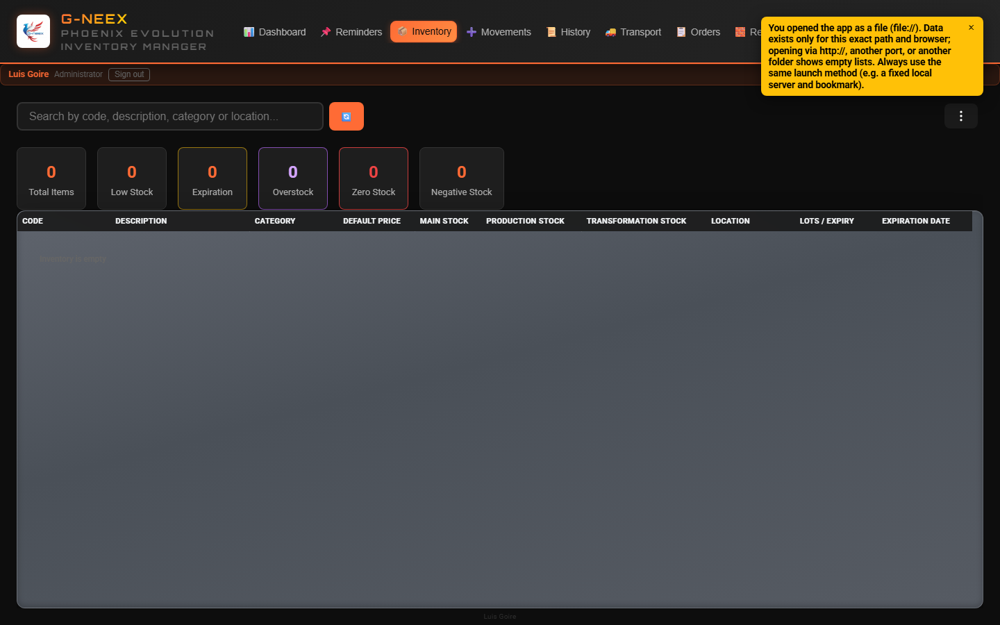
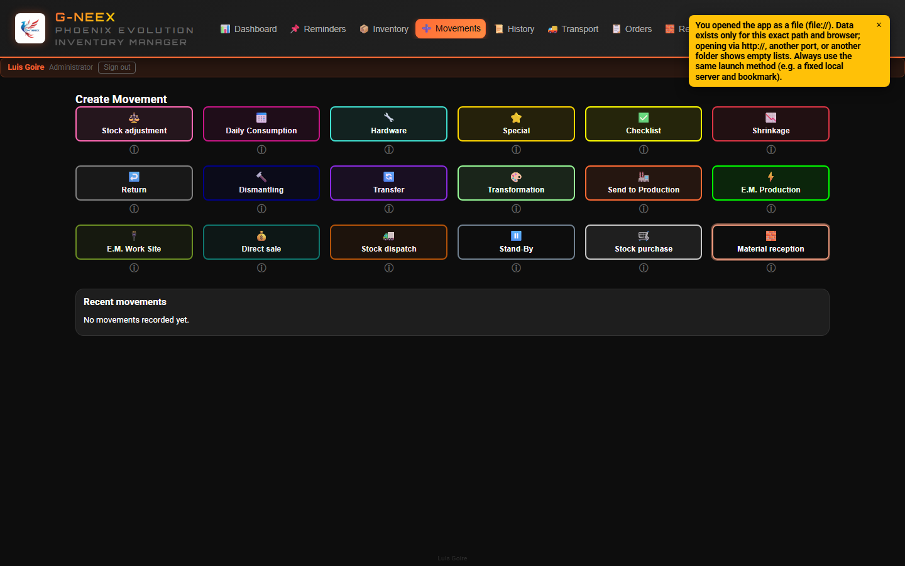
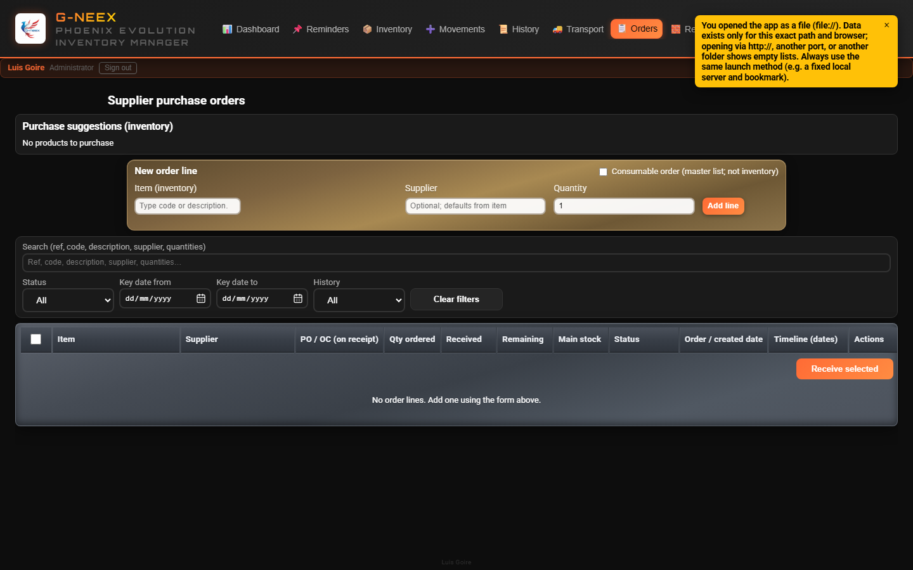
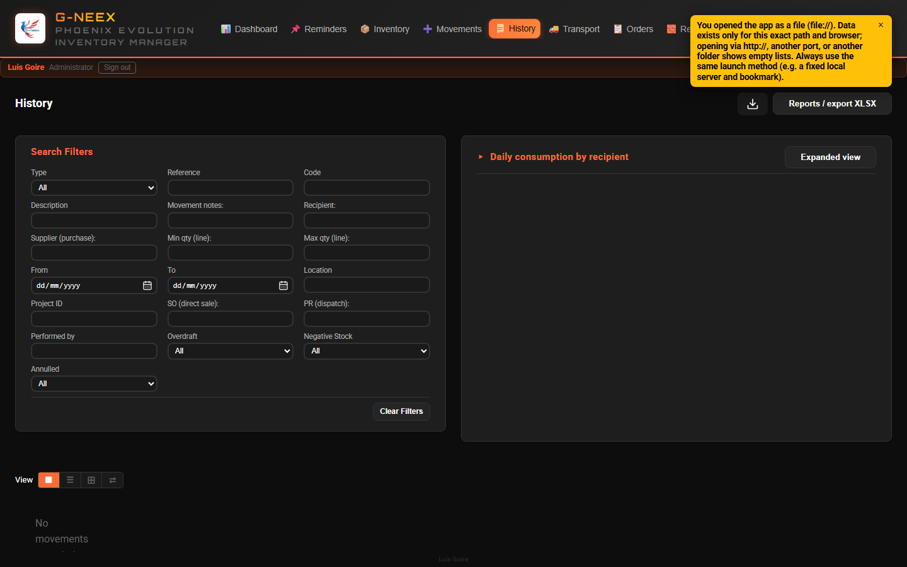
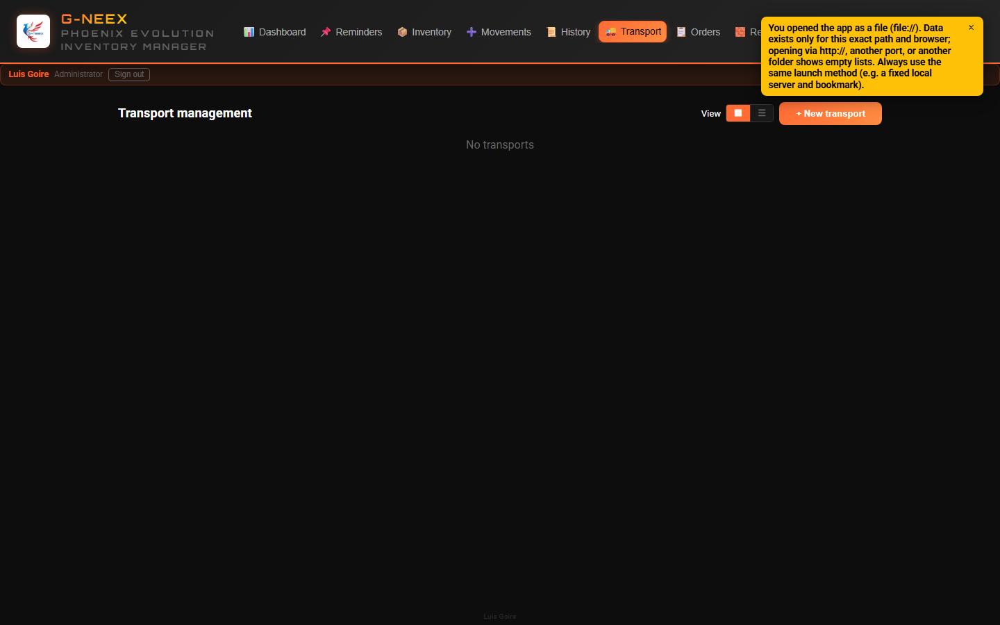
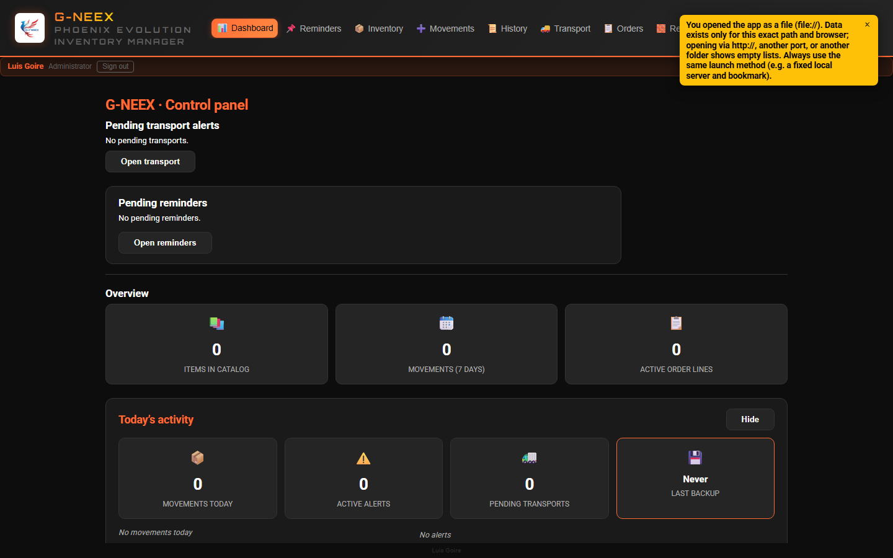
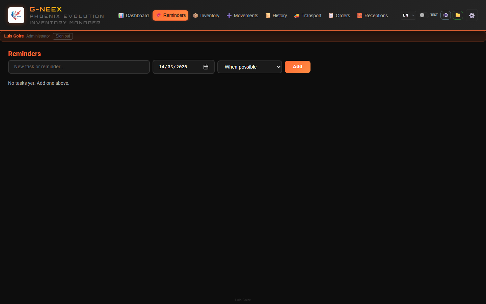

# Phoenix Cell G-NEEX 1.7

### Comprehensive Inventory and Logistics Management System

*Built by **Luis Goire** — programming enthusiast, aspiring professional developer.*
*Updated: May 2026 (v1.7)*

---

## Project background

- **Industrial need:** stricter inventory control with only a PC—no other stack available.
- **Excel roots:** a workbook that grew with macros as shop-floor issues appeared; it became an embedded inventory manager.
- **Two-track learning:** automate responses to real problems while building scripting and programming skills.
- **Phoenix:** after serious file loss and recovery, the name means “rising from the ashes”; that sheet is the DNA of G-NEEX.
- **Today:** the Phoenix spreadsheet still runs where it helps until G-NEEX is fully mature for daily web use—this is a step toward what comes next.

---

## The Problem

Electrical installation and industrial project companies face daily challenges:

- **Material chaos** — No one knows what's in stock or where it is
- **Untracked movements** — Materials leave without documenting who, when, or why
- **Disorganized transport** — Paper checklists, trucks without tracking
- **No traceability** — Impossible to trace the source of a shortage or excess
- **Internet dependency** — Cloud systems that fail when you need them most

---

## The Solution: G-NEEX

**G-NEEX** is a web application that works **100% offline**, directly in the browser, with no need for external servers or internet connection.

**Browser-stored data:** inventory, movements, and session live in the browser’s local storage. Lock the workstation, use personal accounts, export backups regularly, and only import JSON backups from trusted sources.

**Same URL every time:** data is scoped to the browser *origin* (protocol, host, port, path). Use one fixed launch method (e.g. local server `http://127.0.0.1:PORT/`). Do not mix opening `index.html` as `file://` with `http://` or hop between ports — empty-looking lists are often a different storage bucket.

**Backup & Import/Export:** the Import/Export tab and critical backup actions are limited to the **administrator account**; temporary elevation does not replace that role. Login backgrounds may rotate per `assets/login-bg-manifest.json`. Full JSON backup includes the **units-of-measure catalog** (symbols and equivalences). When importing JSON, keys **missing** from the file no longer erase unrelated local data (older backups won’t wipe the units catalog, for example).

**Units of measure:** ⚙️ Settings → **Units** maintains symbols and equivalences; the catalog keeps a reserved **U** row (cannot delete). Each article may set a **stock unit** or leave it unset — no automatic fill to **U**. Inventory shows the symbol next to main stock **when a unit is chosen** (and optional **≈** equivalent); optional CSV columns `UnidadStockSimbolo` / `UnidadEquivalenteSimbolo`. Movement screens still use plain numbers — operators must stay consistent with each article’s stock unit.

It manages the entire material lifecycle:

**Intake** → **Warehouse** → **Dispatch** → **Transport** → **Job Site**

*Real v1.6 captures (Playwright). Regenerate: `docs/app-screenshots/README.md`.*


---

## Real-Time Inventory



| Feature | Description |
|---------|-------------|
| **Full overview** | Table with code, description, category, main/production/transformation stock, location, and expiration date |
| **Units of measure** | Stock unit symbol next to main qty when the article has a unit (optional **≈**); ⚙️ **Units** + **Article editing** |
| **3 independent stocks** | Main, Production, and Transformation — each with its own tracking |
| **Instant search** | Live filter by code, description, category, or location |
| **Tools menu (⋮)** | First item **Hide inline filter bars** (chevron): closes box / depot / consumable strips; **disabled** when no strip is open. The **⋮** menu groups export, print, filters, as-of date, summaries, etc. |
| **Box / location filter** | Dropdown: BOX columns (from Location text **and** box-stock rows), warehouse catalog (E1R, ETOP, BIN 8, ARMOIRE…) **and** per-location stock chips; chips in the table |
| **Box summary** | Groups by inferred box number; modal row click for lines (E1R etc. still detected in filter and tags) |
| **Operational box stock** | Real per-item box management: add/edit/delete boxes, redistribute across boxes / prod. & trans. columns and transfer from box to direct location (no box) with per-location balances (`E2R: 12`); unified **Datos** sheet (**Codigo, Caja, UbicacionCaja, CantidadCaja, CantidadCajas, Vacia**) for template, full export, and re-import |
| **Automatic alerts** | Low stock, negative stock, overstock, and upcoming expirations |
| **Low-stock detail modal** | Columns: ignore alert, **Actions** (🛒 add to purchase list), **Code**, then the rest of the item fields |
| **As-of date mode** | View inventory exactly as it was on a selected date |
| **Color coding** | Rows colored by item status for immediate visual identification |
| **Export & print** | Downloadable XLSX (themed table styling) and formatted print view |

---

## 18 Movement Types



G-NEEX supports **18 movement types** covering all operations in an industrial warehouse:

The type buttons use a fixed **6 columns × 3 rows** layout; on narrow viewports the area supports **horizontal scrolling** without losing alignment.

| Category | Types |
|----------|-------|
| **Daily operations** | Daily Consumption, Adjustment, Hardware, Special |
| **Projects / Job site** | Checklist, E.M. Job Site, E.M. Production, Waste |
| **Sales / site shipment** | Direct sale (SO required), Stock dispatch (project & PR required) |
| **Reverse logistics** | Return, Dismantle |
| **Production** | Send to Production, Transformation, Transfer |
| **Supply** | Stock Purchase, Material Reception |
| **Planning** | Stand-By (drafts with no effect until released) |

On the **Movements** tab, choosing a type opens the form in an **in-app overlay window** (the type grid stays visible behind it).

For types that **subtract stock**, **Stock source** lets you choose **which depot** the quantity comes from: **main** (General warehouse), **boxes**, **locations** (labels only in the list), **production stock**, and **transformation stock** (quantity shown when applicable); the same SKU can appear on **multiple lines** with different sources. When both **Destination** and source appear, **source** drives the physical deduction and **destination** may differ. **Direct sale** and **Stock dispatch** allow **main, boxes, or locations only** (not production or transformation); direct sale requires **SO** (`SO` + 4–6 digits); dispatch requires **project** and **PR** (`PR` + 4–6 digits). Movement refs: **VDT** and **EXP** prefixes + 6 digits per type.

**Site E.M.:** line **quantities** are inventory; **Process movement** asks for **total boxes** for the shipment (allocated across lines by quantity).

Each movement automatically records:
- **Who** performed it
- **When** it was executed
- **Previous stock** for each affected item
- **Justification** in case of overdraft

---

## Floating shortcuts (Stand-by & daily consumption cart)

- Floating shortcuts (default: bottom-right) stay **hidden until** you select the type under **Movements**: **Stand-by** (⏸) and **Daily consumption** (📅).
- **Hide** each from its panel (⏬); preference stored in the browser.
- **Drag** the round button to move them on screen; position is saved on the device. Tap without dragging opens/closes the panel.
- **Daily consumption cart:** pending lines per local day; **auto close/catch-up** after a date change or if the app was closed (stock rules). With **Daily consumption** selected under Movements, the form is not interrupted (~23:00 / midnight roll); switching movement types applies anything pending.
- **Movement date (Daily consumption):** each line stores when it was added; on **process**, the movement timestamp is the **first** line in the cart (fallback: process time if a line has no stamp).
- **Numbers:** at most **four decimal places** in the UI and in stored values (rounding).
- **“Other” recipient:** type the name freely when it is not in the dropdown lists.

---

## Supplier orders (order lines)



- **Orders** tab: lines tied to inventory (supplier, quantity); **PO/OC** is captured on **receipt** in Stock purchase.
- Panel filters: text search (ref/code/description/supplier/quantities), status, key date range (from/to), and timeline preset (with/without receipt, ordered, cancelled).
- States: draft → ordered → partial/full receipt or cancelled; dates kept for tracking.
- **Receipt** opens the same **Stock purchase** form as under Movements; confirm with **Process movement**.
- Purchases logged **only** under Movements can trigger **Yes / No** prompts to link to a pending order and update the Orders panel (received / status / actions).
- **Export / Print table** use the current filtered view; there is bulk cleanup (+1 year) and per-line removal (>3 months).
- Movement **references** use **type letters + 6-digit sequence per type** (e.g. `AJU000001`, `COM000002`); legacy refs normalize on load.
- Some categories use **provisional reception** with mandatory PO before main-stock impact.
- **Actual receipt date (optional):** you can set a past date for traceability (notes/timeline), while movement registration time stays current.

---

## List layouts (Explorer-style)



- **History**, **Transport**, and **Orders** include a **View** control for **tiles**, a compact **list**, and (where relevant) a **detailed table**; in **History**, a **Chronological carousel** is also available for horizontal card browsing. Minimized cards also show the **Project ID** when relevant.
- In **History**, movements that are fully voided or **partial annulments** show a **diagonal stamp** (tilted dashed frame); filters also include annulment type.
- New **Movement notes** filter; **SO (direct sale)** and **PR (dispatch)** filters; **Add note** in detail appends without erasing; **box stock management** saves also create **Adjustment (AJUSTE)** records.
- **On-screen dates (app-wide):** day, 3-letter month, 4-digit year; with time, local **24-hour** clock.
- In **History → Daily consumption by recipient**, the table now supports **editing recipients**, **saving changes**, and **clearing visible rows** using the current filters.
- **Attachments (📎)** in movement detail and expanded transport: link files from any folder (no copy into the app); open with Chrome/Edge. JSON backups do not include file bytes—re-link on another PC.
- **Print** from movement detail opens **tables** (aligned with XLSX export), not an on-screen layout snapshot.
- **A4 portrait** printing; tables avoid equal-width column squeeze; article **code** stays one-line and readable.

---

## Smart Transport



The transport module automates shipment logistics to job sites:

- **Automatic creation** — Checklists and E.M. Job Site generate transports automatically
- **Multi-truck** — A project can have multiple transports if the load requires it
- **Visual board** — Cards with status, lines, and expedition date
- **Controlled shipping** — Can only ship when all lines are resolved
- **Manual creation** — For exceptional cases without an associated checklist
- **Full history** — Record of every action performed on the transport
- **Traceability** — Transport tab summary (receptions waiting to ship, quantities on active truck lines, recent shipments, stock on hand) plus an editable **manual list** by material family and phase (on-site / truck / departed)
- **Per-truck report** — Each truck can **Export** or **Print** a cargo table with materials, quantities, and current dimensions

---

## Dashboard — Instant Overview



Upon login, a panel displays the current operational status:

```
┌──────────────────┬──────────────────┬──────────────────┬──────────────────┐
│ MOVEMENTS TODAY  │  ACTIVE ALERTS   │    PENDING       │  LAST BACKUP     │
│                  │                  │   TRANSPORTS     │                  │
│       12         │        5         │        3         │     Today        │
│  ▸ Consumption:4 │  ▸ Low stock: 2  │                  │                  │
│  ▸ Checklist: 3  │  ▸ Negative: 1   │                  │                  │
│  ▸ Adjustment: 5 │  ▸ Expiring: 2   │                  │                  │
└──────────────────┴──────────────────┴──────────────────┴──────────────────┘
```

Visual indicators alert if there is critical stock or if the backup is more than 7 days old.

---

## Reminders (Admin)



- Dedicated tab for operational reminders with due date and priority.
- Priorities can auto-escalate by business-day aging.
- Dashboard includes reminder preview with quick navigation.

---

## The app in use (on-screen)


- G-NEEX groups daily work in modules you open from the top bar: inventory, movements, history, transport, orders, reminders, and settings.
- The user manual explains each screen and workflow. **How** access and copies are run on your site is an operational matter; the focus here is day-to-day **use** of the interface and inventory features.

---

## Reports and Exports

**6 report types** as **.xlsx** workbooks (orange header row, centered bold data, auto column widths) with descriptive filenames:

- Transport summary
- Detailed transport lines
- Filtered movements (respects active filters)
- Filtered movement lines
- All movements
- Consumption by specific item

Files include the date range in their name:

`GNEEX_All_Movements_2024-03-15_to_2026-04-15.xlsx`

---

## Data Protection

| Feature | Description |
|---------|-------------|
| **Full backup** | Exports the full database to JSON (inventory, movements, staff and occasional recipient lists, etc.) |
| **Restore** | Imports a previous backup and restores the full system |
| **Archive movements** | Exports old movements and removes them to free space |
| **Reimport archives** | Reintegrates archived movements without duplicating data |
| **Movements-only export / merge** | Export movement history alone; merge adds new ids only, applies stock (no full-db overwrite) |
| **Initial inventory** | Bulk item upload via **CSV** or **XLSX** plus downloadable **.xlsx** template with the correct columns and styling |
| **Backup alert** | Dashboard warns if more than 7 days without a backup |

---

## Multi-Language and Customization

### 3 full languages
- 🇪🇸 Español
- 🇺🇸 English
- 🇫🇷 Français

### 2 visual themes
- 🌙 Dark mode
- ☀️ Light mode

### Demo mode (optional)
- **Test** switch: **blue** theme and full app use; when turned off, **previous data** is restored and demo changes are **discarded**
- **Light/dark** theme and **language** are not reverted
- Confirmation to exit; banner under the header

### Responsive design
- Adapts to desktop, tablet, and mobile screens
- Optimized text without unnecessary line breaks
- Professional typography (Roboto + Orbitron)

---

## Technical Specifications

| Aspect | Detail |
|--------|--------|
| **Technology** | HTML5, CSS3, JavaScript (vanilla) |
| **Storage** | Browser localStorage |
| **Connection** | No internet or server required |
| **Installation** | Open `index.html` in any modern browser |
| **Compatibility** | Chrome, Edge, Firefox, Safari |
| **References** | Movement codes use type prefix + per-type digits (`AJU…`, `COM…`…); legacy may be digits-only |
| **Multiple PCs** | Each browser keeps its own localStorage; data is not shared just by opening the same URL |
| **External dependencies** | Optional web fonts; **XLSX** export uses a **bundled** `xlsx-js-style` build in `vendor/` (no npm install) |
| **Size** | Lightweight, loads in seconds |

---

## Why G-NEEX?

| Advantage | Traditional competition | G-NEEX |
|-----------|------------------------|--------|
| Cost | High monthly licenses | **Free** |
| Internet | Requires permanent connection | **100% offline** |
| Installation | Servers, databases, IT | **Open a file** |
| Learning curve | Weeks of training | **Intuitive immediate use** |
| Customization | Rigid or expensive | **Adapts to your workflow** |
| Data | On third-party servers | **On your machine, under your control** |

---

## Module Overview

```
                        ┌─────────────┐
                        │  DASHBOARD  │
                        └──────┬──────┘
           ┌───────────────────┼───────────────────┬───────────────────┐
           │                   │                   │                   │
    ┌──────▼──────┐    ┌──────▼──────┐    ┌──────▼──────┐    ┌──────▼──────┐
    │  INVENTORY  │    │  MOVEMENTS  │    │   ORDERS    │    │  TRANSPORT  │
    │             │    │             │    │ (supplier)  │    │             │
    │ • Items     │    │ • 18 types  │    │ • PO lines  │    │ • Automatic │
    │ • 3 stocks  │    │ • Stand-By  │    │ • Receipt → │    │ • Manual    │
    │ • Alerts    │    │ • Overdraft │    │   purchase  │    │ • Shipping  │
    │ • Search    │    │ • Reference │    │ • XLSX      │    │ • Board     │
    └──────┬──────┘    └──────┬──────┘    └──────┬──────┘    └──────┬──────┘
           │                   │                   │                   │
           └───────────────────┴───────────────────┴───────────────────┘
                        ┌──────▼──────┐
                        │  HISTORY +  │
                        │   REPORTS   │
                        └──────┬──────┘
                        ┌──────▼──────┐
                        │CONFIGURATION│
                        │             │
                        │ • Lists     │
                        │ • Editor    │
                        │ • Import/   │
                        │   export    │
                        │ • Recep.    │
                        └─────────────┘
```

---

## What's new in 1.7 (May 2026)

- **Cinematic welcome splash (~6 s)** after login: a "boot up"-style sequence with a slow **Matrix-green scanner**, **orbital rings** around the logo, **strong neon flicker on "G-neex"**, sweeping reveal of "WELCOME TO", "PHOENIX EVOLUTION" and your name. Also acts as a real loading buffer for the app.
- **Logo as refresh shortcut**: clicking the header logo spins it counter-clockwise and triggers the unified **Update inventory** action (normalize locations / boxes, reconcile main stock with boxes + locations, refresh lot expiry from shelf life). Same action also available in the tools menu.
- **Boxes integrated into main stock**: main stock now reconciles to `max(current, sum(boxes + locations))`; consuming from a box decrements the main stock too. The new action repairs older backups where main and containers were out of sync.
- **Lots editor on the item**: add multiple expedition / explicit expiry / quantity rows per item with live computation of effective expiry from the declared **shelf-life in months**. Stock purchases auto-feed one lot per row.
- **Expiration insight** with a new **Affected quantity** column (already-expired plus soon-to-expire units) and breakdown tooltip.
- **Lot tooltip in the table** shows a synthetic "Unassigned (rest of main stock)" row when at least one explicit lot exists, so the sum reconciles with main stock.
- **Stock-only template**: export XLSX with code + main stock only, edit by hand, re-import to update *only* quantities without touching the catalog.
- **Equivalence** (`≈`) badge in the inventory table now has stronger contrast in both light and dark themes.
- **Alignment with `gneex-hosted-api`**: `GneexApiClient` (still offline today) reserves the wiring for future login JWT, `GET/PATCH /api/v1/sync` and `POST /api/v1/backup/import` once the backend is live in production.

---

## Contact

**Phoenix Cell G-NEEX v1.7**

Industrial inventory management — simple, secure, offline.

**Author:** Luis Goire — hobby development; passionate about programming and growing as a developer.

**Email:** [blakillbyte@gmail.com](mailto:blakillbyte@gmail.com)

---

