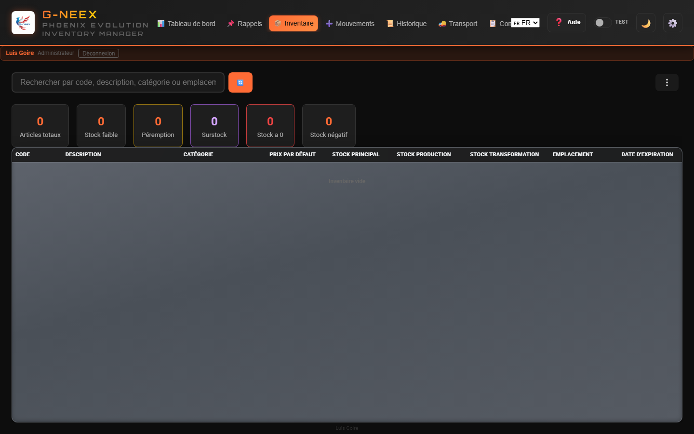
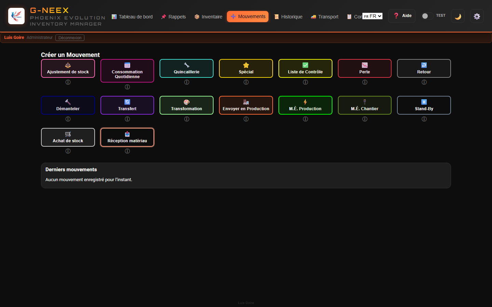
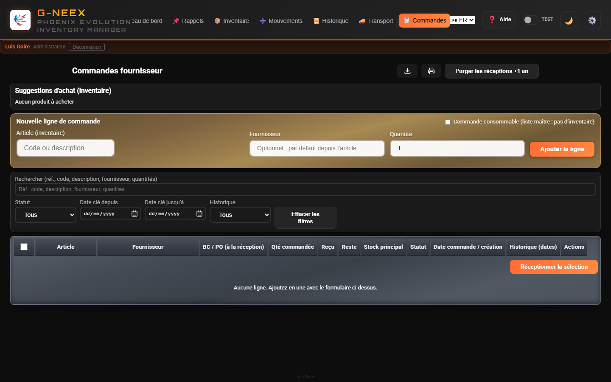
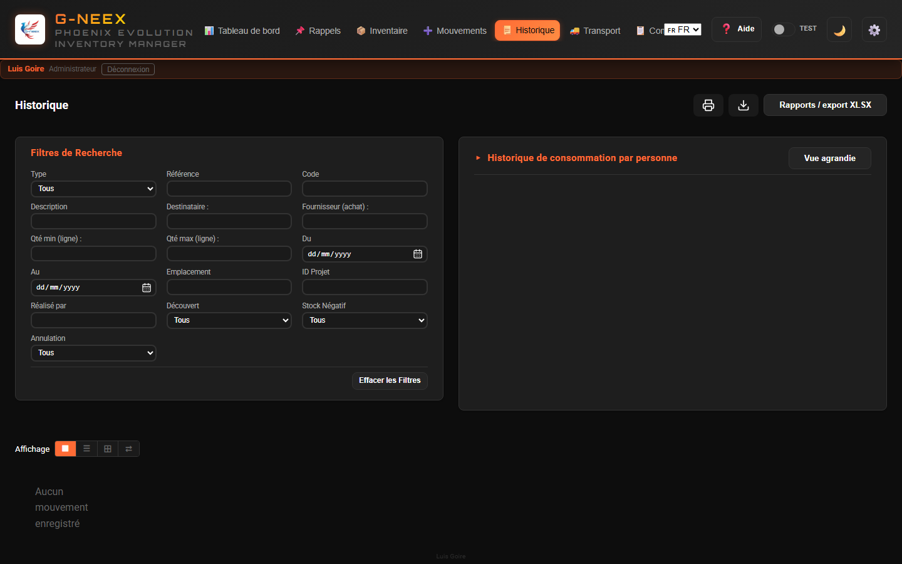
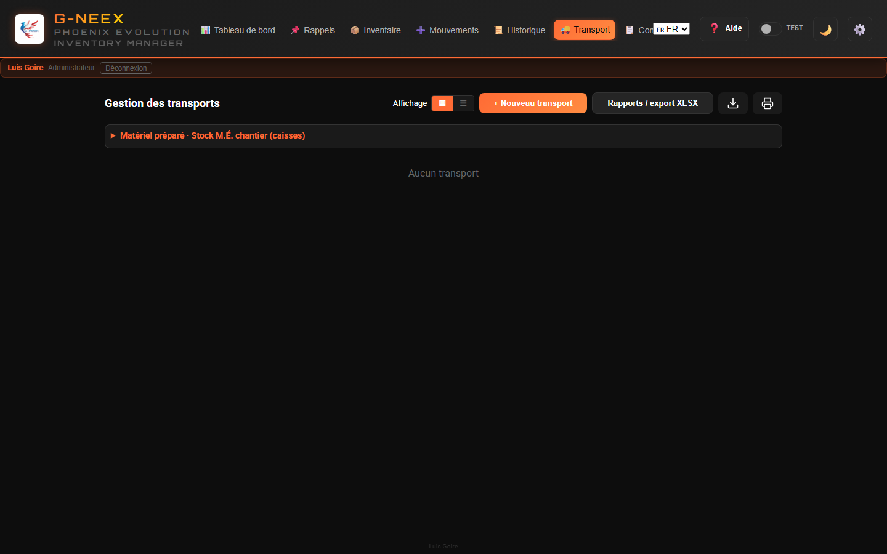
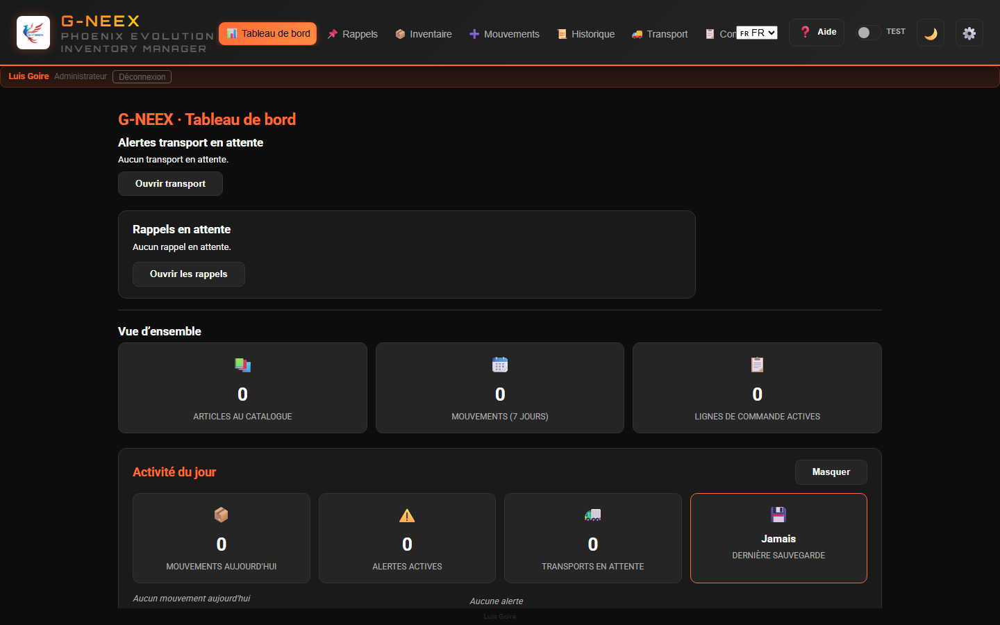
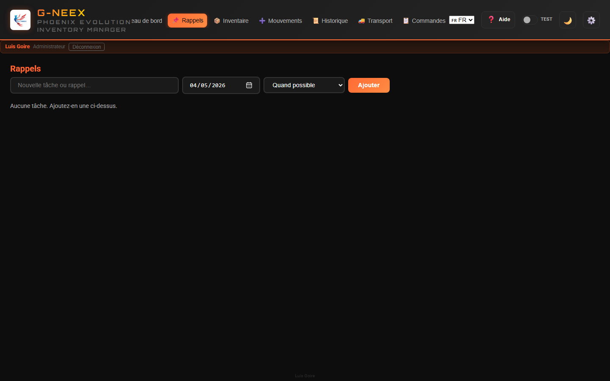

# Phoenix Cell G-NEEX 1.6

### Système Intégral de Gestion d'Inventaire et de Logistique

*Développement : **Luis Goire** — passionné de programmation, en route vers le métier de développeur.*
*Mis à jour : mai 2026*

---

## Contexte du projet

- **Besoin industriel :** contrôle des stocks renforcé avec seul un poste fixe, sans autre infrastructure.
- **Origine Excel :** feuille enrichie de macros face aux aléas quotidiens ; évolution vers un gestionnaire intégré.
- **Double apprentissage :** automatiser tout en consolidant programmation et scripts.
- **Phoenix :** après une perte grave puis récupération du fichier, le nom évoque la renaissance ; cette feuille est l’ADN de G-NEEX.
- **Aujourd’hui :** la ligne Phoenix en tableur reste là où elle sert jusqu’à maturité web pleine de G-NEEX — une étape vers la suite.

---

## Le Problème

Les entreprises d'installations électriques et de projets industriels font face à des défis quotidiens :

- **Désordre des matériaux** — On ne sait pas ce qui est en stock ni où ça se trouve
- **Mouvements non tracés** — Du matériel sort sans documenter qui, quand ni pourquoi
- **Transports désorganisés** — Checklists papier, camions sans suivi
- **Aucune traçabilité** — Impossible de remonter à l'origine d'un manque ou d'un excédent
- **Dépendance à internet** — Systèmes cloud qui tombent quand on en a le plus besoin

---

## La Solution : G-NEEX

**G-NEEX** est une application web qui fonctionne **100% hors ligne**, directement dans le navigateur, sans besoin de serveurs externes ni de connexion internet.

**Données dans le navigateur :** inventaire, mouvements et session sont stockés localement. Verrouillez le poste, utilisez des comptes nominatifs, exportez des sauvegardes et n’importez des fichiers JSON que s’ils proviennent d’une source de confiance.

**Sauvegarde et Import/Export :** l’onglet Import/Export et les opérations critiques de sauvegarde sont réservés au **compte administrateur** ; l’élévation temporaire ne remplace pas ce rôle. Les fonds de connexion peuvent défiler selon `assets/login-bg-manifest.json`. À l’import JSON, les clés absentes ne suppriment plus des données locales non liées.

**Même URL à chaque fois :** les données dépendent de l’*origine* du navigateur (protocole, hôte, port, chemin). Conservez une URL fixe (par exemple `http://127.0.0.1:PORT/`) et ne mélangez pas `file://` et HTTP.

**Unités de mesure :** le catalogue conserve l’unité réservée **U** ; chaque article peut définir une unité de stock ou aucune (pas d’affectation automatique à U).

Elle gère tout le cycle de vie du matériel :

**Réception** → **Entrepôt** → **Sortie** → **Transport** → **Chantier**


---

## Inventaire en Temps Réel



| Fonction | Description |
|----------|-------------|
| **Vue complète** | Tableau avec code, description, catégorie, stocks Principal/Production/Transformation, emplacement et date d'expiration |
| **3 stocks indépendants** | Principal, Production et Transformation — chacun avec son propre suivi |
| **Recherche instantanée** | Filtre en direct par code, description, catégorie ou emplacement |
| **Menu outils (⋮)** | Première option **Masquer les filtres en ligne** (chevron) : ferme les bandes caisse / dépôt / consommable ; **désactivée** si aucune bande n’est ouverte. Le menu **⋮** regroupe export, impression, filtres, vue à date, résumés, etc. |
| **Filtre caisse / emplacement** | Liste : caisses BOX1… (texte Emplacement **et** gestion par caisse), catalogue (E1R, ETOP, BIN 8, ARMOIRE…) **et** stock par emplacement en pastilles ; pastilles dans le tableau |
| **Résumé par caisse** | Regroupement par numéro de caisse déduit ; ligne cliquable (E1R etc. aussi détectés dans le filtre et les étiquettes) |
| **Stock par caisse opérationnel** | Gestion réelle par article : ajout/modification/suppression de caisses, répartition caisses / prod. et trans., plus transfert de caisse vers emplacement direct (sans caisse) avec soldes par emplacement (`E2R: 12`) ; feuille unifiée **Datos** (**Codigo, Caja, UbicacionCaja, CantidadCaja, CantidadCajas, Vacia**) pour modèle, export complet et réimport |
| **Alertes automatiques** | Stock bas, négatif, surstock et expiration prochaine |
| **Modal détail stock bas** | Colonnes : ignorer l’alerte, **Actions** (🛒 liste d’achat), **Code**, puis les autres champs |
| **Mode à date** | Consulte l'inventaire exactement tel qu'il était à une date sélectionnée |
| **Code couleur** | Lignes colorées selon l'état de l'article pour identification visuelle immédiate |
| **Exporter et imprimer** | XLSX téléchargeable (tableau mis en forme) et vue d'impression formatée |

---

## 16 Types de Mouvement



G-NEEX supporte **16 types de mouvement** couvrant toutes les opérations d'un entrepôt industriel :

| Catégorie | Types |
|-----------|-------|
| **Opérations quotidiennes** | Consommation Quotidienne, Ajustement, Quincaillerie, Spécial |
| **Projets / Chantier** | Checklist, M.E. Chantier, M.E. Production, Perte |
| **Logistique inverse** | Retour, Démantèlement |
| **Production** | Envoi en Production, Transformation, Transfert |
| **Approvisionnement** | Achat de Stock, Réception de Matériel |
| **Planification** | Stand-By (brouillons sans effet jusqu'à leur libération) |

Dans l'onglet **Mouvements**, le choix d'un type ouvre le formulaire dans une **fenêtre superposée dans l'application** (la grille des types reste visible derrière).

Pour les types qui **soustrent du stock**, la colonne **Origine stock** permet de choisir **depuis quel dépôt** la quantité est prélevée : **principal** (Entrepôt général), **caisses**, **emplacements** (étiquette seule dans la liste), **stock de production** et **stock de transformation** (quantité affichée si applicable) ; la même référence peut figurer sur **plusieurs lignes**. Lorsqu’une colonne **Destination** s’ajoute à l’origine, l’**origine** correspond au prélèvement physique et la **destination** peut différer.

**M.É. chantier :** les **quantités** par ligne sont du stock ; au **Traiter le mouvement**, on saisit le **total de caisses** pour l'envoi (réparti entre les lignes selon les quantités).

Chaque mouvement enregistre automatiquement :
- **Qui** l'a effectué
- **Quand** il a été exécuté
- **Stock précédent** de chaque article affecté
- **Justification** en cas de dépassement

---

## Bulles flottantes (Stand-by et panier consommation quotidienne)

- Bulles d'accès (par défaut en bas à droite), **masquées jusqu'à** choisir le type dans **Mouvements** : **Stand-by** (⏸) et **Consommation quotidienne** (📅).
- **Masquer** depuis chaque panneau (⏬) ; préférence enregistrée dans le navigateur.
- **Glisser** le bouton rond pour les déplacer ; position mémorisée sur l'appareil. Un clic sans glissement ouvre ou ferme le panneau.
- **Panier consommation :** lignes en attente par jour local ; **clôture / rattrapage** automatiques après changement de jour ou app fermée (règles de stock). Avec le type **Consommation quotidienne** sélectionné dans Mouvements, le formulaire n’est pas interrompu (~23 h / passage de jour) ; en changeant de type, le traitement en attente s’applique.
- **Date du mouvement :** chaque ligne mémorise son ajout ; au **traitement**, la date du mouvement correspond au **premier** article du panier (secours : heure du traitement si horodatage absent).
- **Décimales :** au plus **quatre chiffres** après la virgule à l’affichage et dans les valeurs enregistrées (arrondi).
- **Destinataire « Autre » :** saisir librement le nom lorsqu'il n'est pas présent dans les listes déroulantes.

---

## Commandes fournisseur (lignes de commande)



- Onglet **Commandes** : lignes liées à l'inventaire (fournisseur, quantité) ; le **BC/PO** est enregistré à la **réception** dans Achat de stock.
- Filtres du panneau : recherche texte (référence/code/description/fournisseur/quantités), statut, date clé (du/au) et préréglage d'historique (avec/sans réception, commandée, annulée).
- États : brouillon → commandée → réception partielle / totale ou annulée ; dates conservées pour le suivi.
- La **réception** ouvre le même formulaire **Achat de stock** que dans Mouvements, puis **Traiter le mouvement**.
- Une saisie **uniquement** depuis Mouvements peut afficher **Oui / Non** pour lier l’achat à une ligne de commande ouverte et mettre à jour quantité reçue / statut / actions.
- **Exporter / Imprimer le tableau** utilisent la vue filtrée ; nettoyage massif (+1 an) et suppression par ligne (>3 mois).
- **Références** : **sigle du type + 6 chiffres corrélés par type** (ex. `AJU000001`, `COM000002`) ; les anciennes valeurs sont normalisées au chargement.
- Certaines catégories passent en **réception provisoire** avec BC/PO obligatoire avant impact sur le stock principal.
- **Date réelle de réception (optionnel) :** peut être passée pour la traçabilité (notes/chronologie) en conservant l'heure réelle d'enregistrement du mouvement.

---

## Dispositions de liste (style Explorateur)



- **Historique**, **Transport** et **Commandes** proposent un sélecteur **Affichage** : **mosaïque**, **liste compacte** et, selon l’écran, **tableau détaillé** ; dans **Historique**, un **Carrousel chronologique** est aussi disponible pour parcourir les cartes à l’horizontale. Les cartes minimisées affichent aussi l’**ID projet** quand pertinent.
- Dans **Historique**, les mouvements entièrement annulés ou avec **annulation partielle** affichent un **tampon diagonal** (cadre en pointillés incliné) ; les filtres incluent aussi le type d’annulation.
- **Dates à l’écran (toute l’app) :** jour, mois en trois lettres, année sur quatre chiffres ; avec l’heure, **24 h** locale.
- Dans **Historique → Consommation quotidienne par destinataire**, le tableau permet désormais de **modifier les destinataires**, **enregistrer les changements** et **nettoyer les lignes visibles** selon les filtres.
- **Pièces jointes (📎)** dans le détail d’un mouvement et le transport déplié : lient des fichiers dans n’importe quel dossier (sans copie dans l’app) ; ouverture avec Chrome/Edge. Les sauvegardes JSON n’incluent pas les fichiers : relier sur un autre PC.
- **Imprimer** depuis le détail d’un mouvement ouvre des **tableaux** (alignés sur l’export XLSX), pas la mise en page à l’écran.
- Impression **A4 portrait** ; colonnes non écrasées de la même façon ; **code** article sur une ligne lisible.

---

## Transport Intelligent



Le module transport automatise la logistique d'envoi vers le chantier :

- **Création automatique** — Les checklists et M.E. Chantier génèrent des transports automatiquement
- **Multi-camion** — Un projet peut avoir plusieurs transports si la charge l'exige
- **Tableau visuel** — Cartes avec statut, lignes et date d'expédition
- **Expédition contrôlée** — Ne peut expédier que lorsque toutes les lignes sont résolues
- **Création manuelle** — Pour les cas exceptionnels sans checklist associée
- **Historique complet** — Registre de chaque action effectuée sur le transport
- **Traçabilité** — Résumé dans l’onglet Transport (réceptions en attente d’expédition, quantités sur lignes actives, derniers départs, stock en entrepôt) plus une **liste manuelle** éditable par famille de matériau et phase (sur site / camion / parti)
- **Rapport par camion** — Chaque camion permet d’**Exporter** ou d’**Imprimer** un tableau de chargement avec matériaux, quantités et dimensions actuelles ; avec **plusieurs colis** par ligne, le XLSX et l’impression utilisent des **lignes empilées** (colonnes fixes **Colis**, **L**, **l**, **H**), sans multiplier les colonnes.

---

## Tableau de Bord — Vue d'Ensemble Instantanée



À la connexion, un panneau affiche l'état actuel des opérations :

```
┌──────────────────┬──────────────────┬──────────────────┬──────────────────┐
│MOUVEMENTS DU JOUR│ ALERTES ACTIVES  │   TRANSPORTS     │DERNIÈRE SAUVEG.  │
│                  │                  │    EN ATTENTE     │                  │
│       12         │        5         │        3         │  Aujourd'hui     │
│  ▸ Consomm.: 4   │  ▸ Stock bas: 2  │                  │                  │
│  ▸ Checklist: 3  │  ▸ Négatif: 1    │                  │                  │
│  ▸ Ajustement: 5 │  ▸ Expiration: 2 │                  │                  │
└──────────────────┴──────────────────┴──────────────────┴──────────────────┘
```

Des indicateurs visuels alertent en cas de stock critique ou de sauvegarde de plus de 7 jours.

---

## Rappels



- Onglet dédié pour les rappels opérationnels avec date cible et priorité (selon les droits du profil).
- Les priorités peuvent monter automatiquement selon les jours ouvrables.
- Le tableau de bord inclut un aperçu et un accès rapide aux rappels.
- **Chaque utilisateur ne voit que les rappels qu’il a créés** (les données restent dans la sauvegarde JSON de la machine).

---

## L’application à l’écran (usage)


- G-NEEX regroupe le travail quotidien en modules accessibles depuis la barre : inventaire, mouvements, historique, transport, commandes, rappels et paramètres.
- L’administrateur définit les utilisateurs sous **⚙️ Paramètres → Utilisateurs** avec des modèles génériques ou des **profils de référence** (même comportement que les comptes intégrés) ; les clés sont décrites dans **`PlantillasPermisos.xlsx.csv`**.
- Le manuel décrit chaque écran et parcours. **Comment** l’accès et les copies sont gérés sur votre site relève de l’exploitation ; l’accent est mis ici sur l’**usage** de l’interface et des fonctions d’inventaire.

---

## Rapports et Exportations

**6 types de rapport** au format **.xlsx** (en-tête orange, données centrées en gras, largeurs de colonnes) avec noms de fichiers descriptifs :

- Résumé des transports
- Lignes de transport détaillées
- Mouvements filtrés (respecte les filtres actifs)
- Lignes de mouvements filtrés
- Tous les mouvements
- Consommation par article spécifique

Les fichiers incluent la plage de dates dans leur nom :

`GNEEX_All_Movements_2024-03-15_to_2026-04-15.xlsx`

**Réceptions (Configuration) :** export ou impression de la liste filtrée : même principe de **colis en lignes** que le rapport de chargement.

**Consommables :** marquer un article comme **consommable d’inventaire** dans l’éditeur et enregistrer ajoute son nom à **Configuration → Consommables** ; décocher retire l’entrée correspondante.

---

## Protection des Données

| Fonction | Description |
|----------|-------------|
| **Sauvegarde complète** | Exporte toute la base en JSON (inventaire, mouvements, destinataires effectif et occasionnels, etc.) |
| **Restauration** | Importe une sauvegarde précédente et restaure tout le système |
| **Archiver les mouvements** | Exporte les anciens mouvements et les supprime pour libérer de l'espace |
| **Réimporter les archives** | Réintègre les mouvements archivés sans dupliquer les données |
| **Export / fusion mouvements seuls** | Exporte seul l’historique ; la fusion ajoute les nouveaux ids et applique le stock (sans écraser toute la base) |
| **Inventaire initial** | Chargement massif par **CSV** ou **XLSX** + téléchargement d’un modèle **.xlsx** avec les bonnes colonnes et le style |
| **Alerte de sauvegarde** | Le tableau de bord avertit si plus de 7 jours sans sauvegarde |

---

## Multilingue et Personnalisation

### 3 langues complètes
- 🇪🇸 Español
- 🇺🇸 English
- 🇫🇷 Français

### 2 thèmes visuels
- 🌙 Mode sombre
- ☀️ Mode clair

### Mode démo (optionnel)
- Interrupteur **Test** : thème **bleu** et usage normal ; à la désactivation, **restauration** des données d’avant la démo et **perte** des changements faits pendant
- Thème **clair/sombre** et **langue** non restaurés
- Confirmation à la sortie ; bandeau sous l’en-tête

### Design responsive
- S'adapte aux écrans de bureau, tablette et mobile
- Textes optimisés sans sauts de ligne inutiles
- Typographie professionnelle (Roboto + Orbitron)

---

## Spécifications Techniques

| Aspect | Détail |
|--------|--------|
| **Technologie** | HTML5, CSS3, JavaScript (vanilla) |
| **Stockage** | localStorage du navigateur |
| **Connexion** | Aucun internet ni serveur requis |
| **Installation** | Ouvrir `index.html` dans n'importe quel navigateur moderne |
| **Compatibilité** | Chrome, Edge, Firefox, Safari |
| **Références** | Codes mouvements : sigle + chiffres par type (`AJU…`, `COM…`…) ; anciennes données uniquement numériques possibles |
| **Plusieurs postes** | Chaque navigateur conserve ses données dans le localStorage ; pas de partage automatique en ouvrant la même URL |
| **Dépendances externes** | Polices web optionnelles ; export **XLSX** via bibliothèque **xlsx-js-style** incluse dans `vendor/` |
| **Taille** | Léger, se charge en quelques secondes |

---

## Pourquoi G-NEEX ?

| Avantage | Concurrence traditionnelle | G-NEEX |
|----------|---------------------------|--------|
| Coût | Licences mensuelles élevées | **Gratuit** |
| Internet | Connexion permanente requise | **100% hors ligne** |
| Installation | Serveurs, bases de données, IT | **Ouvrir un fichier** |
| Courbe d'apprentissage | Semaines de formation | **Utilisation intuitive immédiate** |
| Personnalisation | Rigide ou coûteux | **S'adapte à votre flux de travail** |
| Données | Sur des serveurs tiers | **Sur votre machine, sous votre contrôle** |

---

## Vue d'Ensemble des Modules

```
                        ┌─────────────┐
                        │ TABLEAU DE  │
                        │    BORD     │
                        └──────┬──────┘
           ┌───────────────────┼───────────────────┬───────────────────┐
           │                   │                   │                   │
    ┌──────▼──────┐    ┌──────▼──────┐    ┌──────▼──────┐    ┌──────▼──────┐
    │ INVENTAIRE  │    │ MOUVEMENTS  │    │ COMMANDES   │    │ TRANSPORT   │
    │             │    │             │    │ (fournis.)  │    │             │
    │ • Articles  │    │ • 16 types  │    │ • Lignes BC │    │ • Automati. │
    │ • 3 stocks  │    │ • Stand-By  │    │ • Réc. →    │    │ • Manuel    │
    │ • Alertes   │    │ • Dépassem. │    │   achat     │    │ • Expédit.  │
    │ • Recherche │    │ • Référence │    │ • XLSX      │    │ • Tableau   │
    └──────┬──────┘    └──────┬──────┘    └──────┬──────┘    └──────┬──────┘
           │                   │                   │                   │
           └───────────────────┴───────────────────┴───────────────────┘
                        ┌──────▼──────┐
                        │HISTORIQUE + │
                        │  RAPPORTS   │
                        └──────┬──────┘
                        ┌──────▼──────┐
                        │CONFIGURATION│
                        │             │
                        │ • Listes   │
                        │ • Éditeur  │
                        │ • Import/  │
                        │   export   │
                        │ • Récep.   │
                        └─────────────┘
```

---

## Contact

**Phoenix Cell G-NEEX v1.6**

Gestion d'inventaire industriel — simple, sécurisé, hors ligne.

**Auteur :** Luis Goire — développement par passion ; intérêt pour la programmation et progression vers le métier de développeur.

**E-mail :** [blakillbyte@gmail.com](mailto:blakillbyte@gmail.com)

---
