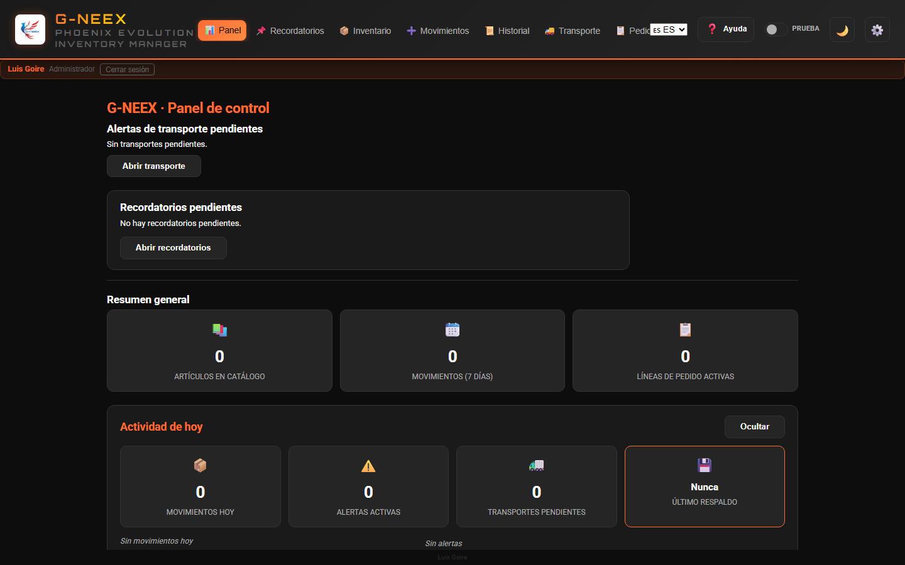
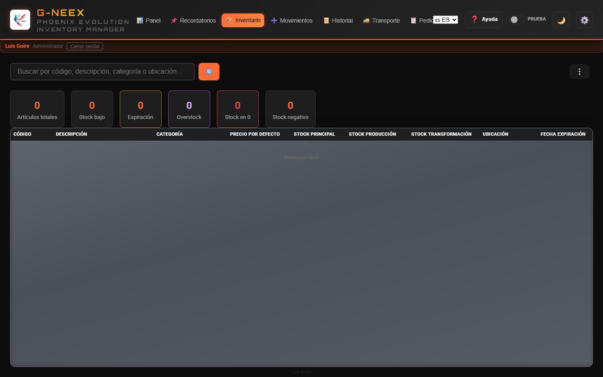
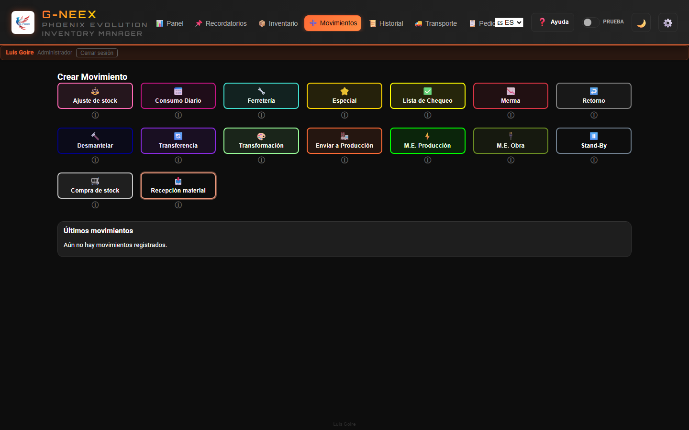
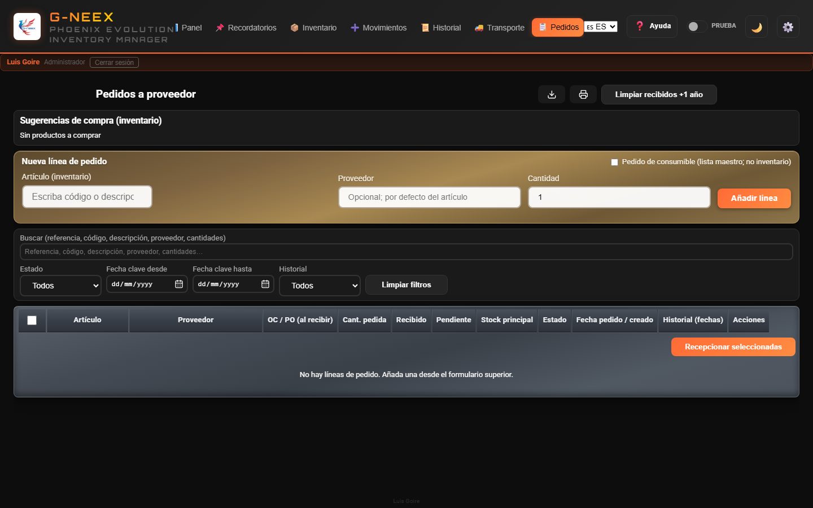
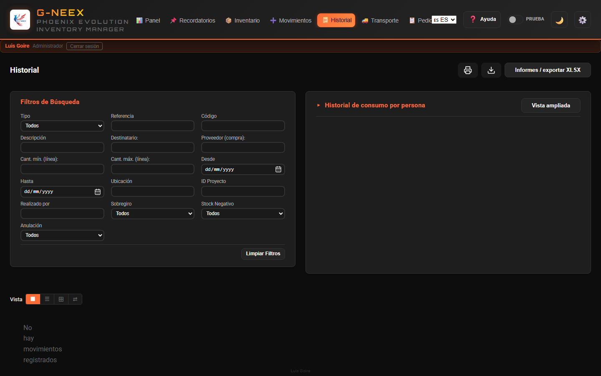
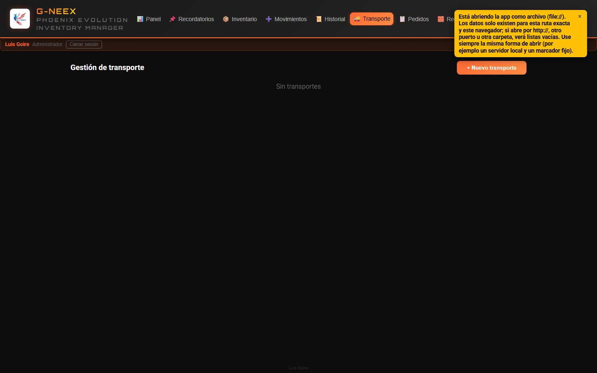
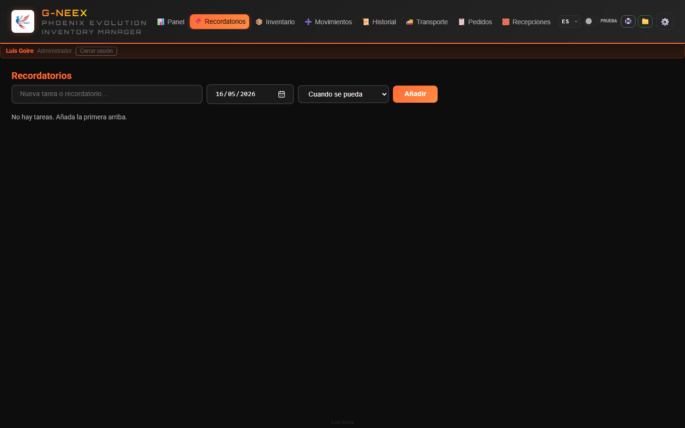

# Manual de Usuario — Phoenix Cell G-NEEX 1.7

*Phoenix Cell G-NEEX es desarrollada por **Luis Goire**, de forma aficionada y con interés en la programación, en camino a formarse como programador.*
*Actualizado: mayo de 2026 (v1.7)*

## Novedades 1.7 (mayo 2026) — leer antes que el resto

> Si vienes de la 1.6, los puntos abajo son lo único nuevo. El resto del manual aplica igual.

- **Pantalla de bienvenida cinemática (~6 s):** al iniciar sesión arranca una secuencia tipo «boot up»; la duración total la marca **`--welcome-duration`** en CSS (por defecto **6 s**) y sirve también como **margen de carga** de la app. El **scanner verde Matrix** (`#00ff41`) cruza despacio la pantalla, los **anillos orbitales** se cierran alrededor del logo, **«BIENVENIDO A»** se revela por barrido, **«G-neex»** parpadea con **flicker fuerte tipo neón** y queda encendido, y por último aparecen **«PHOENIX EVOLUTION»** y **tu nombre**. La barra de progreso cubre casi toda esa duración útil. No se repite al recargar la pestaña; vuelve a salir al volver a iniciar sesión.
- **Logo del header como atajo «Actualizar inventario»:** un clic en el logo (header arriba a la izquierda) da una vuelta antihoraria y dispara la acción unificada **Actualizar inventario**, que en este orden:
  1. **Normaliza ubicaciones y cajas** (texto libre importado de respaldos antiguos → catálogo canónico; sincroniza `boxStocks` y `locationStocks`).
  2. **Reconcilia stock principal:** ajusta `stockPrincipal = máx(actual, suma(cajas) + suma(ubicaciones))`. **Nunca reduce** el principal; solo lo sube si tus cajas/ubicaciones suman más.
  3. **Refresca caducidades de lotes:** los lotes con caducidad **calculada** pasan a recalcularse al vuelo con la vida útil vigente del artículo. **Los lotes con caducidad escrita a mano se preservan.**
  Antes de aplicar, se muestra un modal con el detalle por sección (hasta 5 filas por bloque). Si no hay nada que hacer, sale un toast informativo y no se aplica nada. La misma acción está accesible desde el menú de herramientas (↺) y se puede activar por teclado con Enter / Espacio sobre el logo.
- **Cajas integradas al stock principal:** consumir, mover o editar una caja actualiza el stock principal automáticamente. Si tienes respaldos viejos donde no cuadran, la acción **Actualizar inventario** los repara sin pisar lo que ya hay.
- **Editor de lotes en el artículo:** en ⚙️ → editar artículo hay una sección nueva **Lotes (caducidad por compra)** donde añades, una por línea, **fecha de expedición + caducidad explícita opcional + cantidad**. La caducidad efectiva se calcula al vuelo a partir de la **vida útil en meses** del artículo si no escribes una caducidad explícita. Cada compra de stock añade un lote por fila automáticamente; puedes editarlos o borrarlos después.
- **Caducidad: vencidos o próximos a vencer — columna «Cantidad afectada»:** suma de unidades en lotes vencidos + próximos a vencer, con tooltip de desglose. Útil para priorizar qué bajar a planta antes.
- **Tooltip de lotes en la tabla:** si hay al menos un lote explícito, aparece una fila sintética «Sin lote (resto del stock principal)» para que la suma cuadre con el stock principal. Si no hay lotes, el tooltip queda vacío (sin ruido).
- **Plantilla solo-stock (export/import):** dos opciones nuevas en el menú de herramientas:
  - 🧾 **Exportar plantilla solo-stock** → XLSX con `Codigo`, `Descripcion`, `StockPrincipal` (editable). Nada más.
  - ♻ **Importar actualización solo-stock** → re-lee ese mismo XLSX y solo actualiza cantidades del stock principal. No toca ubicaciones, lotes, ni catálogo.
- **Equivalencia (`≈`) más legible:** la columna del inventario muestra un badge con mayor contraste en tema claro y oscuro.
- **Alineación con futuro `gneex-hosted-api`:** la app sigue 100 % offline; el cliente `GneexApiClient` queda preparado para conectarse al backend cuando esté en producción (login JWT + sync + import respaldo). Ver `no-deployar/docs/BACKEND_ALINEACION.md`.

## Antecedentes y propósito

### Necesidad en planta

Phoenix Cell G-NEEX surge de una necesidad real en entorno industrial: reforzar el **control de inventario** cuando no había más ayuda tecnológica que un **ordenador**, sin margen para otras infraestructuras ni soluciones externas.

### De la hoja de cálculo al gestor

La base fue una **hoja Excel** que, frente a incidencias diarias de fábrica y a errores operativos, fue incorporando **macros y automatización**, problema a problema. Aquello evolucionó de un cuadro de control hacia un **gestor de inventario** integrado en la propia hoja.

### Aprendizaje y automatización

Paralelamente, ese trabajo se convirtió en **aprendizaje práctico**: al automatizar respuestas a problemas reales se consolidaron conocimientos de **programación y scripts**. Se avanzaba en dos frentes —operativo y formativo— a la vez.

### El nombre «Phoenix» y el ADN del proyecto

Tras un **daño grave** en el archivo, pudo **recuperarse** tras mucho esfuerzo; de ahí el nombre **Phoenix** —lo que renace de sus cenizas—. Esa hoja, recuperada y mejorada, es el **antecedente directo** y, en buena medida, el **ADN** de la aplicación web **G-NEEX**.

### Uso actual y evolución

La línea **Phoenix en hoja de cálculo** sigue utilizándose donde aporta valor hasta que **G-NEEX** alcance plena madurez para el uso cotidiano en **entorno web**. Este software se entiende como un **primer paso** hacia una herramienta que aspira a seguir creciendo.

> El mismo texto contextual está disponible en la aplicación en **⚙️ Configuración → pestaña Antecedentes**.

---

# SECCIÓN 1: Configuración (vista general)

Bajo **⚙️ Configuración** hay ajustes y herramientas de apoyo: copias o intercambio de datos, listas, editor de artículos, recepciones, preferencias, etc. **Este manual explica el funcionamiento y las pantallas de G-NEEX**; el despliegue y la política de uso en su planta o empresa no se documentan aquí.

## 1.1 Datos, importación y exportación

### Quién puede usar Import/Export

La pestaña **Import/Export** solo está disponible para la **cuenta con rol administrador**. No basta con otros permisos ni con una **elevación temporal** de permisos: esas sesiones no ven esa pestaña y, al abrir Configuración, entran en **Antecedentes**. Ahí se agrupan el respaldo JSON completo (exportar/importar), solo movimientos (fusionar), transportes expedidos (fusionar), inventario inicial CSV/XLSX, archivar y reimportar movimientos, borrar base de datos y la vista rápida de destinatarios de Consumo diario. Quien no sea administrador debe usar **Empleados** y el resto de pestañas permitidas para su perfil.

### Respaldo completo

**Ruta:** ⚙️ Configuración → pestaña **Import/Export** (solo administrador)

- **Exportar respaldo:** Genera un archivo `GNEEX_Backup_YYYY-MM-DD_HH-MM-SS.json` con toda la información de la aplicación (inventario —ubicación por artículo, stock por ubicación/caja y catálogo de ubicaciones incluidos—; movimientos; listas de destinatarios de Consumo diario —plantilla y ocasionales/externos—; lista de proveedores; transportes; líneas de pedidos a proveedor; usuarios; contadores de referencias; etc.)
- **Importar respaldo:** Elija el JSON recibido, confirme y siga el aviso en pantalla; sustituye los datos de trabajo de esta instancia. Las claves que **no aparezcan** en ese JSON **no** borran datos locales no relacionados (por ejemplo, el catálogo de unidades).

> Uso habitual del respaldo completo: copia de seguridad o traslado de un entero a otro equipo. Para aportar solo la actividad operativa a otra copia suele usarse además el flujo **exportar / importar solo movimientos** descrito a continuación.

### Mismo sitio web en otro equipo, tableta o teléfono

La aplicación desplegada (por ejemplo en **HTTPS**) se abre en cualquier navegador con la **misma URL**. Los datos viven en el **`localStorage` de cada dispositivo**: no se sincronizan solos entre PC y móvil. Para llevar la misma copia de trabajo a otro aparato, el administrador debe **exportar** el JSON en un equipo y **importarlo** en el otro (correo, nube, cable, etc.). El inicio de sesión y otras funciones que usan criptografía del navegador requieren **HTTPS** o **`localhost`**; si algo falla al abrir solo por IP y `http://` en la red local, use la URL pública de despliegue o consulte el mensaje de error en pantalla.

**Solo movimientos (fusionar actividad):** En el mismo apartado, **Exportar solo movimientos** (`GNEEX_Movements_…json`) e **Importar y fusionar movimientos** intercambian movimientos entre instancias. La **fusión** **añade** únicamente movimientos cuyo **id** no exista ya en la copia de destino y **aplica** las cantidades al inventario (recepciones de material se recrean si el archivo trae datos suficientes). Si el **id** ya existe, se conserva el movimiento local. No sustituye listas, transportes ni el resto de datos; conviene partir de catálogos alineados (mismos artículos) y saber que fechas muy entremezcladas entre copias pueden desajustar el orden lógico del stock. Confirme siempre en el diálogo que muestre la aplicación.

**Nota (respaldos y sobregiro):** El **respaldo completo** y el archivo **solo movimientos** serializan los movimientos tal como están en el almacenamiento local (incluido el campo técnico `hadOverdraft`). El formato y la fusión **no cambian**. Al iniciar, la aplicación puede **normalizar** valores incoherentes en **Compra de stock** y **Recepción de material**. En **historial**, **filtros**, **informes XLSX** y **exportaciones legibles** se aplica una regla coherente: una compra o recepción **no** se trata como sobregiro solo por un flag antiguo incorrecto.

### Listas de destinatarios (Consumo diario)

**Vista rápida:** Solo el administrador ve el bloque en ⚙️ Configuración → **Import/Export** → «Destinatarios (vista rápida)». La edición de plantilla y ocasionales sigue en la pestaña **Empleados**.

### Lista de proveedores (pedidos)

**Ruta:** ⚙️ Configuración → pestaña **Proveedores** para mantener la lista maestra de nombres.

Quien use **Pedidos** puede indicar el proveedor en cada línea (texto libre o sugerencias cargadas desde esa lista). El **número de OC/PO** no se pide al crear el pedido; se registra al **recibir** mercancía en Movimientos → **Compra de stock** (junto al packing slip).

### Archivar movimientos antiguos

Para liberar espacio eliminando movimientos antiguos:

1. Seleccionar una **fecha límite** en el campo "Anteriores a"
2. Pulsar **Archivar**
3. Confirmar la cantidad de movimientos
4. Se descarga el archivo `GNEEX_Archived_Movements_FROM_to_TO_YYYY-MM-DD_HH-MM-SS.json`
5. Los movimientos archivados se eliminan de la aplicación

El JSON incluye una lista legible `movements` (resumen para lectura e informes) y `_rawMovements` con **copia íntegra** de cada movimiento tal como estaba guardado. El campo de sobregiro en la parte legible sigue la **misma regla** que el historial en pantalla; la copia en `_rawMovements` conserva los datos técnicos sin reinterpretar.

### Reimportar movimientos archivados

1. Pulsar **Reimportar archivo**
2. Seleccionar el archivo JSON de archivo
3. Confirmar — los movimientos se reintegran al historial ordenados por fecha
4. No se duplican movimientos que ya existan

### Cargar inventario inicial (CSV o XLSX)

Permite importar un archivo **CSV** o **XLSX** con el inventario inicial. Las columnas deben coincidir con el formato esperado.
Puede usar el **botón de icono de plantilla** para exportar una hoja **.xlsx** con el orden correcto de columnas, estilo (encabezado naranja) y una fila de ejemplo editable. Si edita en Excel, guarde o exporte como CSV con el mismo orden de columnas si prefiere ese formato.

### Borrar base de datos

1. Pulsar **Borrar base de datos**
2. Escribir el código de confirmación: `BORRAR TODO` (o `DELETE ALL` / `SUPPRIMER TOUT`)
3. Se eliminan todos los datos y la página se recarga

> La pantalla pide un texto fijo de confirmación para evitar un borrado accidental; siga el procedimiento operativo de su entorno.

### Seguridad y datos en el navegador

G-NEEX guarda inventario, movimientos, usuarios y sesión en el **almacenamiento local del navegador** (por ejemplo `localStorage`). Las contraseñas se guardan con **hash y sal**; no aparecen en texto plano en el código de la aplicación. Quien tenga acceso al equipo o al perfil de usuario, o una **extensión del navegador maliciosa**, podría leer o alterar esos datos. La aplicación **no sustituye** a un servidor central con políticas corporativas de identidad. Use **bloqueo de sesión del sistema**, cuentas personales y **respaldos exportados** según el procedimiento de su organización. Al **importar un archivo JSON** de respaldo, compruebe que procede de una fuente de confianza.

---

## 1.2 Editor de artículos

**Ruta:** ⚙️ Configuración → pestaña **Edición de artículo**

Al entrar, si la aplicación solicita un **código de desbloqueo**, siga el asistente en pantalla (crear o validar) y use **Desbloquear** para continuar. Luego busque el artículo por código o descripción, modifique los campos (código, descripción, categoría, precio por defecto, stocks, ubicación, mínimo, máximo, etc.) y pulse **Guardar**.

Para **Ubicación**, puede componer el texto con **varias etiquetas separadas por coma**; el selector incluye agrupadas las **ubicaciones del catálogo efectivo** y **BOX1…BOX51** para añadirlas con **Agregar**, además del catálogo de ubicaciones en la misma pestaña (⚙️).

### Modo consumible de inventario y lista maestra «Consumibles»

Si marca **Tratar como consumible de inventario** y pulsa **Guardar**, la aplicación **añade** automáticamente el nombre (la **descripción** del artículo, o el **código** si no hubiera descripción) a la lista de **⚙️ Configuración → Consumibles**, usada para constancias de compra sin inventario y pedidos de consumible. Si **desmarca** esa opción y guarda, **elimina** de esa lista la entrada que coincidiera con la descripción o código **antes del cambio** (si estaba en la lista por ese vínculo).

El comportamiento de stock del modo consumible (qué movimientos alteran o no cantidades) sigue las pantallas y mensajes de la aplicación.

---

## 1.3 Configuración de expiraciones

**Ruta:** ⚙️ Configuración → pestaña **Expiraciones**

1. Establecer los **días de alerta** globales (ej. 30 = alertar 30 días antes de que expire)
2. Buscar un artículo específico
3. Asignarle una **vida útil en meses** desde la fecha de emisión
4. Pulsar **Guardar**

---

# SECCIÓN 2: Uso de la aplicación

## 2.1 Acceso a la sesión

Introduzca **usuario** y **contraseña**. La sesión se valida en el navegador; la cuenta **administrador** puede crear usuarios y cambiar contraseñas en **⚙️ Configuración → Usuarios**.

Al **añadir un usuario** con rol «Usuario», puede elegir una **plantilla**: **Supervisor** y los **perfiles de referencia integrados** (por ejemplo Keith Lake, Guest, Patrick). Las plantillas antiguas de operarios ya no se ofrecen para nuevas cuentas. Cada opción muestra una **descripción breve** al pasar el ratón por encima (atributo `title`). Para un **administrador nuevo**, seleccione rol **Administrador**; ese rol no usa plantilla de matriz. La tabla detallada de claves y permisos está en el archivo **`PlantillasPermisos.xlsx.csv`** en la raíz del repositorio (referencia para documentación y futura API).

Las **imágenes de fondo** de la pantalla de acceso se definen en `assets/login-bg-manifest.json` (rutas bajo `assets/`). Si no hay lista o está vacía, se usa el logo. Cuando hay varias imágenes, pueden **rotar** automáticamente.

Tras conectar, accede al panel (véase la figura de **§2.2**).

---

## 2.2 Dashboard (Panel de resumen)

Al entrar a la aplicación, se muestra un panel con información del día. En la **barra superior** puede cambiar de módulo con los botones (por ejemplo **📦 Inventario** hacia §2.3, **➕ Movimientos** hacia §2.4, etc.):

| Tarjeta | Qué muestra |
|---------|-------------|
| **Movimientos hoy** | Cantidad de movimientos creados hoy, con desglose por tipo |
| **Alertas activas** | Stock bajo + stock negativo + artículos por expirar |
| **Transportes pendientes** | Transportes que no han sido expedidos ni anulados |
| **Último respaldo** | Cuándo se hizo el último respaldo (alerta si hace más de 7 días o nunca) |

Pulsar **Ocultar** / **Mostrar** para colapsar/expandir el panel.

---

## 2.3 Inventario

Vista al pulsar el botón **Inventario** (📦) en la barra de navegación; ahí se ven la búsqueda, filtros, tarjetas y la tabla de artículos.

### Buscar artículos

Escribir en el campo de búsqueda para filtrar por **código, descripción, categoría o ubicación**.

### Menú de herramientas (⋮)

Junto al campo de búsqueda, el botón de menú (tres puntos verticales **⋮**) concentra las acciones del inventario: exportar XLSX, imprimir, mostrar u ocultar las barras de filtro en línea (**Caja / ubicación**, **Depósito**, **Consumible inv.**), filtros de problemas y de alerta de stock bajo desactivada, vista **Stock a fecha**, resumen por caja, gestión por caja, etc.

La **primera opción** del menú es **Ocultar filtros en línea** (icono de flecha hacia la derecha): cierra de una vez las tres barras desplegables cuando alguna está visible y devuelve cada lista a **Todos** si hacía falta. Esa opción está **deshabilitada** cuando ninguna de esas barras está abierta; cuando alguna lo está, sirve para minimizar la zona de filtros sin repetir la acción por cada tipo de filtro.

### Vista de inventario "a fecha"

Usar el filtro **a fecha** para consultar el inventario tal y como estaba en una fecha seleccionada. Mientras está activo, afecta tabla, tarjetas y salidas de exportación/impresión.

### Tarjetas de estadísticas

Las tarjetas superiores muestran:
- **Artículos totales**: cantidad total
- **Stock bajo**: artículos con stock igual o inferior al mínimo
- **Expiración**: artículos expirados o próximos a expirar
- **Overstock**: artículos por encima del stock máximo
- **Stock negativo**: artículos con stock menor a 0

> Pulsar cualquier tarjeta (excepto "totales") abre un **modal de detalle** con la lista de artículos afectados, opción de exportar XLSX e imprimir.

En el modal de **stock bajo**, las primeras columnas son **Ignorar alerta de stock bajo**, **Acciones** (🛒 para añadir el artículo a la **lista de compra**), **Código** y a continuación el resto de campos (descripción, stocks, fechas, ubicación).

### Tabla de inventario

Columnas: Código, Descripción, Categoría, Precio por defecto, Stock Principal, Stock Producción, Stock Transformación, Ubicación, Expiración.

En la columna **Descripción**, el icono **📝** (más suave si el artículo aún no tiene notas) abre, cuando esté activo, un cuadro para **ver y editar las notas**; **Guardar** persiste los cambios. Si el control no ofrece edición pero el artículo **sí tiene notas**, a menudo puede abrirse el cuadro en **solo lectura**; si no hay notas, la celda se muestra como texto normal.

Los colores de las filas y celdas indican el estado del artículo (rojo = negativo, amarillo = bajo, naranja = expirando, verde = bien, etc.). Además: si **toda la fila** muestra un **resaltado violeta/indigo suave con borde**, es la fila **seleccionada con el teclado** (flechas arriba/abajo en la tabla). Si solo la **primera celda (código)** tiene una **banda vertical violeta**, el artículo está marcado como **consumible de inventario**. En la celda de **stock principal**, un **recuadro violeta** puede indicar **sobre-stock** (por encima del máximo configurado).

Si la ventana es estrecha, puede **desplazar la tabla horizontalmente** para ver todas las columnas sin comprimir los encabezados.

**Ubicación (campo de texto del artículo):** para validaciones (movimientos, importaciones, consistencia de stock) solo cuentan como ubicación **canónica** las etiquetas del **catálogo efectivo de almacén** y las referencias **BOXn**. Si el texto guardado no puede normalizarse por completo a ese conjunto, puede aparecer un **aviso** al guardar desde el editor; ya no se inserta ningún marcador automático de reubicación.

Hay un selector **Caja / ubicación** para filtrado rápido por número de caja inferido desde el texto de **Ubicación**, desde los **números de caja** con stock en la gestión por caja, y por **ubicaciones de almacén** del catálogo interno (p. ej. E1R, ETOP, BIN 8, CONTAINEUR CHANTIER, ARMOIRE AVEC CLE) cuando el texto de ubicación coincide **o** la misma ubicación aparece solo en **stock por ubicación** (chips con cantidad); en la tabla se muestran etiquetas junto a la celda. Junto a exportar e imprimir, el botón **Resumen por caja (desde ubicación)** agrupa los artículos cuando en **Ubicación** aparece algo como **BOX1**, **BOX 1** u otras variantes («box», «caja» + número; el espacio después de BOX es opcional); puede haber **varias cajas** en el mismo texto, **separadas por comas** (p. ej. «BOX1, caja 2»); en el modal puede **pulsar una fila** para ver la lista de artículos de esa agrupación. Si un artículo tiene varias cajas en su ubicación, aparece contabilizado en **cada caja detectada**. Además, con **Gestión de stock por caja** puede **añadir, editar, eliminar y repartir** stock entre **cajas** y las columnas **Stock producción** / **Stock transformación**; también puede transferir de **caja a ubicación directa (sin caja)**. Esa operación descuenta la caja origen, añade la ubicación al texto del artículo (sin duplicar) y registra cantidad por ubicación (chips como `E2R: 12`) en la celda de Ubicación. También puede **exportar** todo el stock por caja (mismo formato que la plantilla) para respaldo o edición e **importarlo** de nuevo, descargar una plantilla vacía si la necesita, e importar cantidades por caja. El formato oficial en la primera fila es **Codigo, Caja, UbicacionCaja, CantidadCaja, CantidadCajas, Vacia** (hoja **Datos**, la que genera G-NEEX). En la columna **Vacia** puede usar `1/true/sí` para marcar la caja como vacía (fuerza cantidad 0). En movimientos de salida/consumo la caja es opcional: si la selecciona, descuenta en caja e inventario general; si no, descuenta solo inventario general. Al **guardar** un cambio de **cantidad por caja** con artículo vinculado, también se registra un **ajuste (AJUSTE)** en Historial (motivo opcional), además de actualizar caja y stock principal.

Prueba rápida recomendada (ubicación):
- `BOX1`
- `E1R` o `e1r` (no distingue mayúsculas)
- `BIN 8`, `BIN2` o `BIN 2`
- `CONTAINEUR CHANTIER`
- `BOX1, BOX2`
- `caja 3, BOX4`
- `sin caja`
- `BOX52` (fuera de rango, no se detecta)
- `BOX1, BOX1` (no duplica la misma caja)

### Exportar e imprimir

- **Exportar XLSX**: Descarga la vista actual del inventario (tabla con formato)
- **Imprimir lista**: Abre ventana de impresión con la tabla formateada

Las ventanas de impresión del programa usan **papel A4 vertical** (márgenes estándar); las tablas **no fuerzan todas las columnas al mismo ancho** (la columna **código** del artículo va en una sola línea y legible); el resto del texto largo se **divide en la celda** cuando hace falta (inventario, historial, detalle de movimiento y demás listados imprimibles).

> **Exportar** e **imprimir** en este apartado requieren que esos botones estén visibles y activos en su pantalla.

---

## 2.4 Movimientos

Pestaña **Movimientos** (➕ en la barra superior): la cuadrícula de tipos y, al elegir un tipo, el formulario en ventana superpuesta (véanse los pasos siguientes).

### Crear un movimiento

1. Ir a la pestaña **Movimientos**
2. Seleccionar el **tipo de movimiento** pulsando su botón: se abre una **ventana superpuesta dentro de la aplicación** con el formulario de ese tipo (la vista de Movimientos sigue mostrando solo la cuadrícula y el listado reciente).
3. En esa ventana, rellenar **ID Proyecto** (obligatorio o automático según el tipo) y **Notas**
4. **Buscar artículos**: escribir mínimo 2 caracteres → seleccionar artículo → establecer **cantidad** en la línea como en otros tipos → la línea se añade a la lista (columna **Cantidad**)
5. **Origen de stock** (tipos que **restan** inventario): si aparece la columna **Origen stock**, elija **de qué depósito** sale la cantidad: **Almacén general** (stock principal, con cantidad visible); cada **caja** (la misma cantidad que en **Gestión de stock por caja**); **ubicaciones** del stock por ubicación detallado (solo la etiqueta en la lista); y, cuando corresponda, **stock de producción** o **stock de transformación** (con cantidad visible). Puede **añadir varias líneas** del mismo artículo para repartir cantidades entre orígenes. En tipos que muestran también una columna **Destino** (p. ej. Ferretería, M.E. Producción, M.E. Obra), el **origen** es el depósito físico del que se descuenta; el **destino** clasifica el movimiento y puede ser distinto del origen.
6. Revisar y ajustar **cantidades** en la lista antes de procesar
7. Pulsar **Procesar movimiento**. Si el tipo es **M.E. obra**, aparece una pregunta por el **total de cajas** de ese envío (no por artículo); la aplicación reparte esas cajas entre las líneas según las cantidades de cada una para el stock M.E. obra

Si **todas** las cantidades son **0**, la aplicación **no** permite procesar el movimiento (no hay cambio de stock).

> Los botones de crear y **Procesar movimiento** se usan cuando aparecen activos; si no, el formulario o la acción no están habilitados en su sesión.

### Tipos de movimiento

| Tipo | Efecto en stock | Proyecto |
|------|----------------|----------|
| Ajuste | Suma o resta | Opcional |
| Consumo Diario | Resta | Automático |
| Ferretería | Resta | Obligatorio |
| Especial | Suma o resta | Opcional |
| Lista de Chequeo | Resta | Obligatorio |
| Merma | Resta | Obligatorio |
| Retorno | Suma | Opcional |
| Desmantelar | Suma | Obligatorio |
| Transferencia | Suma o resta | Opcional |
| Transformación | Resta | Opcional |
| Enviar a Producción | Resta | Opcional |
| M.E. Producción | Resta | Obligatorio |
| M.E. Obra | Resta | Obligatorio |
| Stand-By | Sin efecto (pendiente) | Opcional |
| Compra de Stock | Suma | Formulario especial |
| Recepción Material | Suma (o provisional, según reglas de categoría) | Obligatorio |

### Stand-By

Los movimientos Stand-By se guardan como borradores sin afectar el inventario:

1. Crear un movimiento de tipo **Stand-By**
2. Seleccionar el **tipo de liberación** (en qué tipo se convertirá cuando se procese)
3. Procesar el movimiento

**Lista de Stand-By**: Muestra los borradores pendientes con opciones:
- **Editar**: Modificar artículos y cantidades
- **Procesar**: Aplicar el movimiento al inventario
- **Cancelar**: Eliminar el borrador

### Globos flotantes (Stand-by y Consumo diario)

Con la sesión activa, hay hasta dos accesos flotantes (esquina inferior derecha por defecto), **ocultos al inicio**. Para mostrar el globo de **Stand-by** o el de **Consumo diario**, abra **Movimientos** y pulse el tipo correspondiente; el globo vuelve a mostrarse mientras no lo oculte.

| Globo | Función |
|-------|---------|
| **Stand-by** (⏸) | Acceso rápido a borradores Stand-by pendientes; panel con lista, ir a Movimientos u ocultar el globo. |
| **Consumo diario** (📅) | Panel de líneas del tipo Consumo diario aún no procesadas en un solo movimiento. |

- **Ocultar:** desde el panel de cada globo (icono ⏬); la preferencia se guarda en este navegador.
- **Arrastrar:** mantenga pulsado el **botón circular** del globo y arrástrelo por la pantalla; la posición se guarda en este equipo. Si solo pulsa sin desplazar, se abre o cierra el panel como siempre.

**Consumo diario (cierre y recuperación):** las líneas pendientes quedan asociadas al **día local**. Si quedaron líneas de un día anterior (por ejemplo, la aplicación estuvo cerrada o cambió la medianoche con la pestaña abierta), al volver puede mostrarse un aviso y ejecutarse un **cierre/recuperación** automático cuando las reglas de stock lo permiten; si el cierre automático no puede aplicarse por sobregiro, deberá revisar el carrito manualmente. Este tipo de movimiento **no usa número de proyecto** en pantalla. **Mientras tenga seleccionado el tipo Consumo diario** en Movimientos, no se interrumpe con el cierre automático nocturno (≈23:00) ni con el cambio de día; **al cambiar a otro tipo de movimiento** se intentará el cierre pendiente si corresponde.

**Fecha y hora del movimiento (Consumo diario):** cada vez que añade una línea al carrito se registra ese instante. Al **procesar**, la fecha guardada del movimiento es la del **primer artículo** añadido al carrito en ese lote (si alguna línea antigua no tuviera marca, se usa como respaldo la hora en que se procesa).

**Cantidades decimales:** cantidades y stocks se muestran y guardan con **como máximo cuatro dígitos** después del separador decimal (redondeo).

**Destinatario con «Otro (nombre no listado)»:** escriba el nombre libremente cuando no esté en el desplegable. Esta sección solo exige identificar quién recibe el material; no hay clasificación adicional.

**Historial por destinatario editable:** en **Historial → Consumo diario por destinatario** puede editar directamente el nombre del destinatario en la tabla, **guardar cambios** y **limpiar la tabla visible** (según filtros de persona/código) cuando necesite depurar ese registro.

### Sobregiro

Los movimientos que **retiran** stock más allá de lo disponible (consumos, transferencias, envíos a producción, etc.) pueden abrir un modal con **motivo obligatorio** y quedar marcados en el historial con el indicador de sobregiro (`!` y aviso en el detalle).

**Compra de stock** y **Recepción de material** son **entradas** de mercancía: **no** usan ese flujo de justificación por sobregiro. Si en datos antiguos constaba por error un marcador de sobregiro en esos tipos, la aplicación **no lo muestra** como sobregiro en lista, filtros ni detalle, puede **corregir el dato al cargar** y los informes siguen la misma regla.

Al **liberar un Stand-by**, el cálculo de si habría sobregiro usa el **tipo de destino** elegido en el Stand-by (no el tipo que tuviera seleccionado en el formulario de Movimientos en ese instante), para evitar falsos positivos.

### Compra de stock (detalle)

- Es el mismo tipo de movimiento que puede crearse **solo desde Movimientos** o **después de una recepción desde el panel Pedidos** (véase §2.5).
- Campos adicionales en **cada línea** del detalle de compra: **número de PO / orden de compra** (obligatorio por artículo), **proveedor** por línea cuando aplica; además **remito** y datos generales del movimiento.
- Cada movimiento tiene una **referencia con siglas del tipo + 6 dígitos correlativos por tipo** (p. ej. ajuste `AJU000042`, compra `COM000003`), asignada al guardarlo. Las referencias antiguas con más dígitos, solo numéricas (`000042`) o con guion (`COM-001`) se normalizan al cargar el historial.
- Algunas categorías de recepción requieren **PO** y se gestionan como **recepción provisional** (sin impacto inmediato en stock principal).

---

## 2.5 Pedidos a proveedor (órdenes de compra por línea)

**Ruta:** pestaña **Pedidos** (icono 📋 en la barra superior)

Permite planificar líneas de pedido a proveedor vinculadas al inventario (código, descripción, proveedor, cantidad). El **número de OC/PO** se registra al **recibir** en Compra de stock (packing slip), no al crear el borrador.

### Filtros del listado

Encima del listado puede alternar la **Vista** entre **tabla detallada** (por defecto) y **mosaico** de tarjetas; la preferencia se guarda en este navegador.

Encima de la tabla puede **filtrar** líneas por:
- **Búsqueda de texto** (solo referencia, código, descripción, proveedor y cantidades),
- **Estado**,
- **Fecha clave** (desde / hasta),
- **Historial** (con/sin recepción, con pedido registrado, con anulación).

**Limpiar filtros** restablece todo. Si ninguna línea coincide, el mensaje indica que debe ajustar los filtros.

### Estados de una línea

| Estado | Significado |
|--------|-------------|
| **Inactiva** | Borrador: aún no confirmada como pedido enviado; puede editar cantidad y proveedor. |
| **Pedida** | Pedido confirmado; queda fecha de pedido y se espera la mercancía. |
| **Recepción parcial / total** | Según lo recibido respecto a la cantidad pedida. |
| **Cancelada** | Solo si no hubo recepciones. |

### Recepción y compra de stock

Al pulsar **Recepción parcial** o **Recepción total (pendiente)**, la aplicación cambia a la pestaña **Movimientos**, selecciona **Compra de stock** y rellena el formulario (mismo que un pedido manual). Debe revisar **código y proveedor por línea** (y el PO por línea) y pulsar **Procesar movimiento**. El stock entra al confirmar ese movimiento. Si la línea de compra **no** coincide en **código de artículo** y **proveedor** con la línea de pedido, la compra se guarda igual pero **no** se vincula a esa línea (aparece un aviso).

**Compra solo desde Movimientos (sin abrir antes el panel Pedidos):** tras **Procesar movimiento**, si existe una línea en estado **Pedida** o **recepción parcial** con el **mismo código de artículo** y **mismo proveedor** que la línea de compra, puede aparecer un diálogo preguntando si esa compra **corresponde** a ese pedido; los botones son **Sí** y **No** (**No** solo descarta el vínculo). La decisión **no** depende de que el PO del pedido coincida con el de la compra: el PO informado **en cada fila** de la compra es el que se registra en la recepción y puede actualizar la línea de pedido. Si confirma, se aplican cantidad **Recibida**, **estado** y **acciones** del panel como cuando la recepción se abrió desde Pedidos. Si no enlaza ninguna línea, puede proponerse **registrar** la compra como nueva línea de pedido (**Sí** / **No**).

### Historial y exportación

- Cada línea muestra un **número de referencia** tipo `#AJU000012` (siglas + correlativo por tipo; los datos antiguos pueden seguir como solo dígitos) y un **historial de fechas** (creación, pedido, recepciones).
- **Exportar XLSX / Imprimir tabla:** ambos usan la **vista filtrada actual** (solo líneas visibles).
- **Limpieza masiva:** botón para eliminar líneas en **recepción total** con antigüedad mayor a 1 año.
- **Eliminación por línea:** en líneas de **recepción total** aparece acción para quitar la línea cuando su recepción supera 3 meses.
- **Fecha real de recepción (opcional):** en Compra de stock y Recepción de material permite registrar una fecha pasada como referencia (se refleja en notas y seguimiento), manteniendo la fecha/hora real de registro del movimiento.

### Historial de movimientos (vínculo)

Si una compra de stock proviene del panel Pedidos, en el detalle del movimiento aparece un recuadro indicándolo; en la lista del historial la tarjeta puede mostrar el icono 📋.

> Gestionar líneas, recepciones y la exportación XLSX del panel depende de las acciones y botones que tenga visibles al usar **Pedidos** y **Movimientos** en su copia.

---

## 2.6 Historial

### Ver movimientos

La pestaña **Historial** muestra los movimientos filtrados con color e icono según el tipo.

Sobre la cuadrícula, el selector **Vista** permite **Mosaico** (iconos en cuadrícula, por defecto), **Lista** (filas compactas, estilo explorador de archivos), **Detalles** (tabla con columnas) o **Carrusel cronológico** (tarjetas en secuencia horizontal de más reciente a más antiguo; en la franja superior y en cada tarjeta la marca de tiempo va como **día, mes en 3 letras, año en 4 cifras y hora local**; las flechas laterales avanzan **un movimiento**). En las tarjetas minimizadas se muestra también el **ID de proyecto** cuando aplica. La preferencia se guarda en este navegador.

**Formato de fechas:** en toda la aplicación, las fechas en pantalla usan **día**, **mes en tres letras** y **año en cuatro cifras**; si muestran hora, es en **24 h hora local** (inventario, tablas, recordatorios, transporte, metadatos legibles en exportaciones, etc.).

Los movimientos **totalmente anulados** y los de **anulación parcial** (alguna línea anulada sin anular todo el movimiento) se muestran en **Mosaico**, **Lista** y **Carrusel** con un **sello diagonal** (marco discontinuo inclinado); el texto **«Anulado parcial»** identifica el segundo caso. En la vista **Detalles** y en el modal, el **estado** usa la misma denominación.

### Filtros

Puede filtrar por:
- Tipo de movimiento
- Referencia (parcial)
- Código o descripción de artículo (parcial)
- Texto en **notas del movimiento** (parcial; solo el campo de notas del movimiento)
- Destinatario (consumo diario, parcial)
- Rango de fechas
- Ubicación
- ID Proyecto (parcial)
- Realizado por (parcial)
- Sobregiro (sí/no; alinea con el detalle del movimiento — compra y recepción no cuentan marcadores erróneos antiguos)
- Stock negativo (sí/no — basado en stock **actual**)
- Anulación (todos / sin anulación total / anulado parcial / totalmente anulados)

**Limpiar filtros** vacía todos los criterios.

### Detalle de movimiento

Pulsar una tarjeta, una fila de lista o una fila de la tabla de detalles para ver el mismo modal de detalle completo:
- Tipo, referencia, proyecto, fecha y hora, estado
- Quién lo realizó
- **Notas:** texto acumulado del movimiento. Con permiso de **movimientos**, las notas ya guardadas son solo lectura; **Añadir nota** agrega un bloque al final (cabecera con fecha y usuario) sin sustituir el texto anterior.
- Lista de artículos con **stock anterior**, **variación** (+/−) y **stock resultante** tras cada línea (reconstruido desde el inventario y el historial)
- Información de sobregiro si aplica (véase § «Sobregiro»)
- **Adjuntos (📎):** enlaza PDF, fotos o documentos que ya estén en tu equipo; **no se copian** dentro de la carpeta de la aplicación. La app guarda el enlace y puede **abrirlos** al pulsar «Ver archivo» (Chrome o Edge). Tras un respaldo en otro ordenador hay que **volver a enlazar** los archivos. Los adjuntos muy antiguos podían estar copiados bajo `Adjuntos/…`; para esos puede usarse «Copiar ruta (versión antigua)» y abrirlos desde el explorador.
- **Imprimir** abre una ventana con **tablas** (cabecera del movimiento y líneas alineadas con **Exportar XLSX**), no una copia visual del modal.

### Anular movimiento

En el modal de detalle:
- **Anular movimiento completo**: Revierte todo el stock afectado
- **Anular línea individual**: Revierte solo una línea específica

> Anular o revertir en el detalle requiere que el modal muestre esas acciones activas (según el tipo y estado del movimiento).

---

## 2.7 Transporte

Acceso: botón **Transporte** (🚚) en la barra superior. En la pestaña verá el tablero y las acciones (crear, expedir, anular, etc.) según aparezcan habilitadas en su pantalla.

### Panel de transporte

Muestra tarjetas por cada transporte con: proyecto, fecha de expedición, estado de líneas (Listo/Parcial), recepciones vinculadas.

El selector **Vista** permite **Mosaico** (rejilla de tarjetas) o **Lista** (una columna de tarjetas a ancho completo); la preferencia se guarda en este navegador.

Pulsar una tarjeta para expandir su detalle. En el detalle expandido, **Adjuntos (📎)** enlaza documentos del envío desde cualquier carpeta del equipo (sin copiarlos a la app); visualización en Chrome/Edge como en el historial de movimientos.

En la parte superior de la pestaña aparece un resumen **Material preparado para partir**: por cada transporte activo (no expedido ni anulado) cuenta listas de chequeo, movimientos M.E. obra, M.E. producción vinculados al proyecto y recepciones de material del proyecto que **aún no** se han marcado como expedidas. Debajo puede listarse material eléctrico en **cola** cuando aún no hay transporte activo para ese proyecto.

### Expedición y trazabilidad en planta

Al pulsar **Expedir camión**, además de registrar la salida del transporte, la aplicación marca como **expedidos** (ya no en la empresa) los movimientos de **lista de chequeo**, **M.E. obra** y **M.E. producción** incluidos en ese envío y las **recepciones de material** del mismo proyecto que todavía no hubieran sido expedidas (útil cuando hay varios camiones para un proyecto: cada expedición marca solo las recepciones pendientes hasta ese momento). En el **detalle del movimiento** en Historial aparece la fecha si ya salió con transporte. Si **anula expedición**, **reactiva** el planificación o **elimina** el transporte, se revierten esas marcas ligadas a ese transporte.

### Crear transporte manual

1. Pulsar **+ Nuevo transporte**
2. Escribir el **ID del proyecto**
3. Establecer la **fecha de expedición**
4. Se crea el transporte (puede vincular material eléctrico de obra pendiente)

> Si alguna acción no está disponible, el botón en pantalla se muestra inactivo o no aparece.

### Transporte automático

Los movimientos de tipo **Lista de Chequeo** y **M.E. Obra** crean o vinculan transportes automáticamente. Si ya existe un transporte activo para el proyecto, se añaden líneas al existente.

### Acciones de transporte

- **Expedir**: Solo cuando el estado es "Listo" (todas las líneas resueltas)
- **Anular expedición**: Revierte el estado de expedición
- **Eliminar**: Elimina el transporte completo
- **Fusionar líneas**: Herramienta para combinar o separar líneas dentro del transporte
- **Reporte de carga por camión**: En el detalle del camión puede usar **Exportar reporte de carga** (XLSX) e **Imprimir reporte de carga** con materiales, cantidades y dimensiones cargadas. Si una línea tiene **varios paquetes**, en el XLSX y en la impresión cada paquete va en **filas seguidas** con columnas fijas **Paquete**, **L**, **W**, **H** (no se añaden columnas horizontales tipo «Paquete 1 L», «Paquete 2 L», …).

> Algunas operaciones críticas (p. ej. **Expedir**, **Eliminar**) solo se habilitan cuando el estado de las líneas lo permite.

---

## 2.8 Reportes y exportaciones

### Generar un reporte

1. Pulsar el botón de **reporte** (disponible en Historial y Transporte)
2. Seleccionar el tipo de reporte:
   - **Resumen de transportes**
   - **Líneas de transporte**
   - **Movimientos filtrados** (usa los filtros activos del historial)
   - **Líneas de movimientos filtrados**
   - **Todos los movimientos**
   - **Consumo por artículo** (buscar por código o descripción; mientras escribe aparecen sugerencias del inventario; al pulsar una, se rellena el **código** del artículo)
3. Pulsar **Descargar XLSX**

Los archivos se nombran descriptivamente con el rango de fechas (extensión `.xlsx`; hoja «Datos» con encabezados con estilo del tema y hoja «Info» con metadatos de exportación):
- `GNEEX_All_Movements_2024-03-15_to_2026-04-15.xlsx`
- `GNEEX_Item_Consumption_cable_2025-01-10_to_2026-03-20.xlsx`

> El botón de reporte o descarga en **XLSX** se usa cuando está visible; los tipos de informe se eligen en el diálogo.

---

## 2.9 Recepciones

**Ruta:** ⚙️ Configuración → pestaña **Recepciones**

Tabla con todas las recepciones registradas. Se pueden buscar por texto.

- **Exportar** / **Imprimir** (lista filtrada): mismo criterio que el reporte de carga cuando hay **varios paquetes por recepción**: filas apiladas con columnas **Paquete**, **L**, **W**, **H**, sin ensanchar la tabla con muchas columnas por paquete.

- **Editar**: Modificar datos de una recepción existente (revierte y reaplica stock)
- **Eliminar**: Eliminar recepción y revertir su efecto en stock

> **Editar** y **Eliminar** requieren que esos botones aparezcan activos en la fila (según su copia y el movimiento vinculado).

---

## 2.10 Tema, modo demostración e idioma

- **Tema**: Pulsar 🌙/☀️ en la esquina superior derecha para alternar entre modo **oscuro** y **claro**
- **Modo prueba / demostración**: Interruptor **Prueba** junto a la ayuda. Activa tema **azul** y una **copia de trabajo temporal**: puede usar la aplicación con normalidad (movimientos, inventario, configuración, etc.). Al **desactivar** el interruptor, la aplicación **restaura** inventario, movimientos, historial, usuarios, sesión y el resto de datos guardados en el navegador **tal como estaban al activar** el modo; los cambios hechos solo durante la demostración **se pierden**. **No se restauran** el tema claro/oscuro ni el idioma (lo que haya elegido en la demostración se mantiene). Aparece una **banda informativa** bajo la cabecera mientras el modo está activo. Al salir se pide **confirmación**
- **Idioma**: Seleccionar 🇪🇸 Español, 🇺🇸 English o 🇫🇷 Français en el selector de idioma

Las preferencias de tema e idioma se guardan automáticamente. La instantánea del modo demostración es independiente del respaldo JSON. **Nota:** si durante la demostración exporta archivos a una carpeta en su equipo (por ejemplo XLSX en la carpeta del proyecto), esos archivos **no** se eliminan al salir del modo; solo se revierte lo guardado en **localStorage** del navegador.

---

## 2.11 Barra de sesión

En la parte superior se muestran, entre otras, la identidad de la sesión activa, el resumen de rol o modo (según muestre su copia) y **Cerrar sesión** para volver a la pantalla de acceso.

---

## 2.12 Botones inactivos y mensajes

Según el contexto (tipo de tarea, estado de los datos, pestaña abierta), algunas acciones aparecen atenuadas o un mensaje breve explica que la acción no aplica. No indica un fallo de la aplicación: en otro flujo o con otros datos, el mismo botón puede activarse de nuevo.

---

## 2.13 Recordatorios

**Ruta:** botón con icono de recordatorio en la barra, pestaña **Recordatorios** cuando la tenga a la vista.

Desde ahí se crean y gestionan recordatorios operativos con fecha objetivo y prioridad, cuando el módulo esté accesible en su entorno.

- Prioridades: **Cuando se pueda**, **Atención**, **Urgente**
- La prioridad puede escalar automáticamente por días hábiles
- El dashboard muestra vista previa de recordatorios y acceso rápido
- Los recordatorios completados conservan fecha de cierre
- **Visibilidad:** cada usuario solo ve los recordatorios que **él creó** (el JSON de respaldo del equipo puede contener los de todos los usuarios; la pantalla filtra por sesión).

---

## Acerca del autor

La aplicación es obra de **Luis Goire**, quien la desarrolla como aficionado a la programación y con la idea de seguir creciendo en el oficio de programador.

**Correo:** [blakillbyte@gmail.com](mailto:blakillbyte@gmail.com)

---

# Resumen

El manual recorre por secciones el **inventario**, **movimientos**, **pedidos**, **historial**, **transporte**, **recepciones en configuración**, **reportes**, **import/export de datos** y el **modo demostración**. Cada módulo se usa con los botones y pestañas visibles: si algo no aplica, la interfaz lo desactiva o lo oculta sin bloquear el resto del trabajo.
