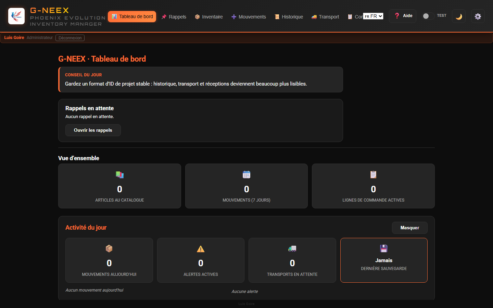
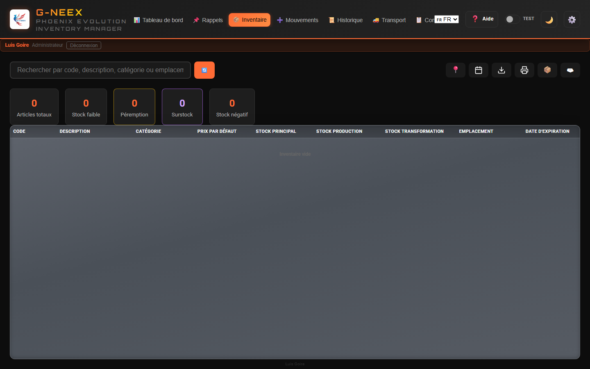
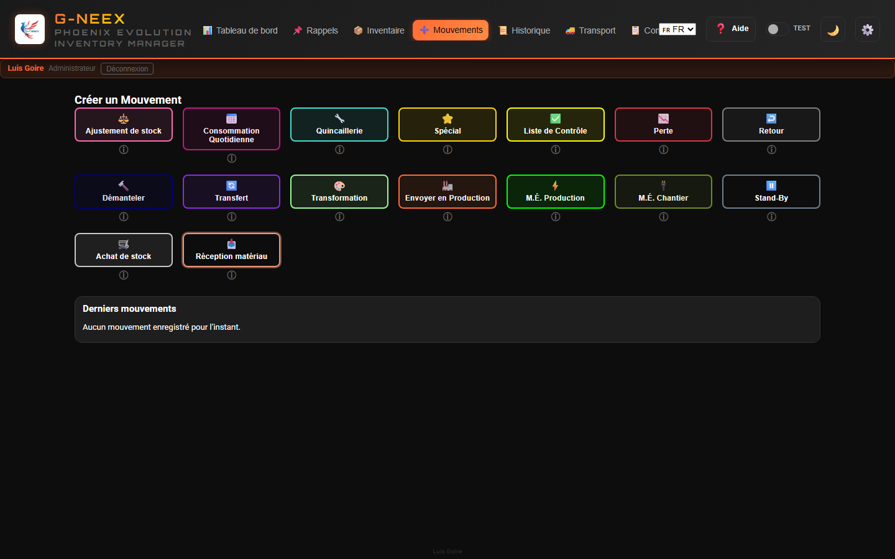
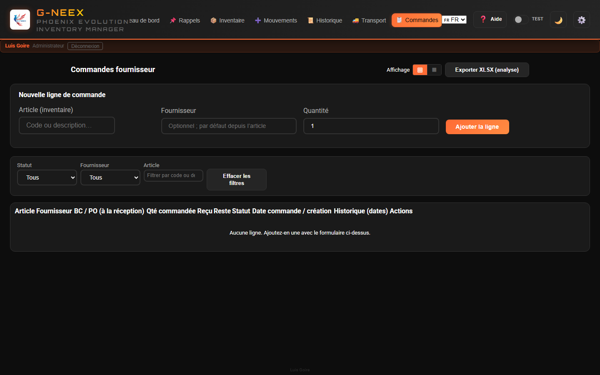
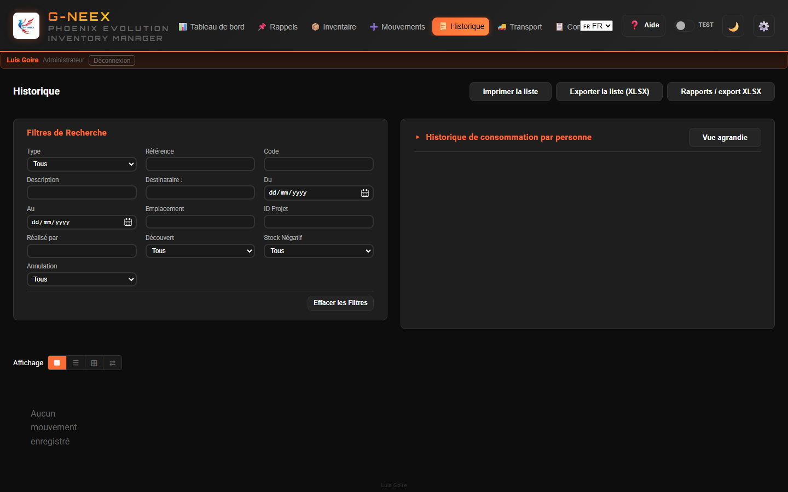
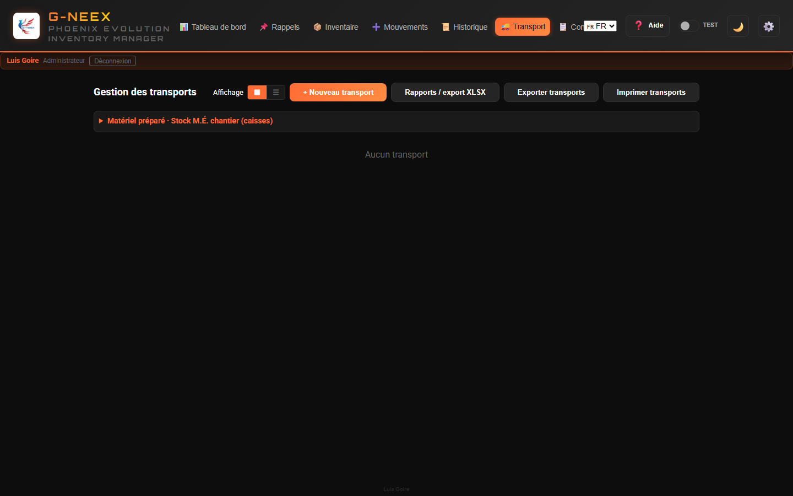
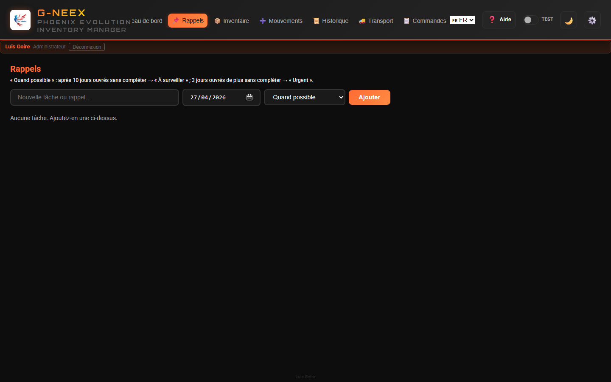

# Manuel Utilisateur — Phoenix Cell G-NEEX 1.7

*Phoenix Cell G-NEEX est développée par **Luis Goire**, par passion pour la programmation et dans une démarche d’apprentissage vers le métier de développeur.*
*Mis à jour : mai 2026 (v1.7)*

## Nouveautés 1.7 (mai 2026) — à lire en premier

> Si vous arrivez de la 1.6, les points ci-dessous sont les seules nouveautés. Le reste du manuel reste valable.

- **Écran de bienvenue cinématique (~6 s) :** après la connexion, une séquence type « boot up » démarre ; la durée totale est pilotée par **`--welcome-duration`** dans le CSS (par défaut **6 s**) et sert aussi de **marge de chargement réelle** pour l'application. Un **scanner vert Matrix** (`#00ff41`) traverse lentement l'écran, les **anneaux orbitaux** se referment autour du logo, **« BIENVENUE SUR »** se révèle par balayage, **« G-neex »** clignote avec un **fort effet néon** avant de rester allumé, puis apparaissent **« PHOENIX EVOLUTION »** et **votre nom**. Une barre de progression linéaire couvre presque tout ce temps utile. L'écran ne se répète pas au rechargement de l'onglet ; il réapparaît à la prochaine connexion.
- **Logo de l'en-tête comme raccourci « Mettre à jour l'inventaire » :** un clic sur le logo (en-tête, en haut à gauche) le fait tourner dans le sens antihoraire et déclenche l'action unifiée **Mettre à jour l'inventaire**, dans cet ordre :
  1. **Normaliser les emplacements et les boîtes** (texte libre des anciens backups → catalogue canonique ; synchronise `boxStocks` et `locationStocks`).
  2. **Réconcilier le stock principal :** ajuste `stockPrincipal = max(actuel, somme(boîtes) + somme(emplacements))`. **Ne réduit jamais** le principal ; il ne fait que monter si les boîtes/emplacements totalisent plus.
  3. **Rafraîchir les péremptions de lots :** les lots dont la péremption était **calculée** sont recalculés à la volée à partir de la durée de vie actuelle de l'article. **Les péremptions saisies à la main sont préservées.**
  Un modal de confirmation montre le détail par section (jusqu'à 5 lignes par bloc) avant d'appliquer. Si rien n'est en attente, un toast info apparaît et rien n'est modifié. La même action est dispo dans le menu outils (↺) et via Entrée / Espace sur le logo en focus.
- **Boîtes intégrées au stock principal :** consommer, déplacer ou modifier une boîte met à jour le stock principal automatiquement. Si vous avez d'anciens backups désynchronisés, **Mettre à jour l'inventaire** les répare sans toucher au reste.
- **Éditeur de lots dans l'article :** dans ⚙️ → éditer l'article, une nouvelle section **Lots (péremption par achat)** permet d'ajouter, une par ligne, **date d'expédition + péremption explicite optionnelle + quantité**. La péremption effective est calculée à la volée à partir de la **durée de vie en mois** de l'article si vous ne saisissez pas de péremption explicite. Chaque achat de stock ajoute un lot par ligne automatiquement ; vous pouvez les éditer ou les supprimer ensuite.
- **Péremption : périmés ou bientôt périmés — nouvelle colonne « Quantité affectée » :** somme des unités dans les lots périmés + bientôt périmés, avec tooltip de détail. Aide à prioriser ce qu'il faut bouger en premier.
- **Tooltip des lots dans le tableau :** dès qu'au moins un lot explicite existe, une ligne synthétique « Sans lot (reste du stock principal) » apparaît pour que la somme corresponde au stock principal. Sans lots, le tooltip reste vide (pas de bruit).
- **Gabarit stock-seul (export/import) :** deux nouvelles options dans le menu outils :
  - 🧾 **Exporter le gabarit stock-seul** → XLSX avec `Code`, `Description`, `StockPrincipal` (modifiable). Rien d'autre.
  - ♻ **Importer la mise à jour stock-seul** → relit ce XLSX et ne met à jour que les quantités du stock principal. Les emplacements, les lots et le catalogue ne sont pas touchés.
- **Équivalence (`≈`) plus lisible :** la colonne d'inventaire affiche maintenant un badge avec un meilleur contraste dans les deux thèmes.
- **Alignement avec le futur `gneex-hosted-api` :** l'application reste 100 % hors-ligne ; le client `GneexApiClient` est préparé pour se connecter au backend une fois en production (login JWT + sync + import de sauvegarde). Voir `no-deployar/docs/BACKEND_ALINEACION.md`.

## Contexte et objectif

### Besoin en atelier

Phoenix Cell G-NEEX naît d’un besoin réel en milieu industriel : renforcer le **contrôle des stocks** lorsque seul un **ordinateur** était disponible, sans marge pour d’autres infrastructures.

### Du tableur au gestionnaire

Le point de départ était une **feuille Excel** qui, face aux incidents quotidiens et aux erreurs d’exploitation, s’est enrichie de **macros et d’automatisation**, problème par problème. Le dispositif est passé d’un tableau de pilotage à un **gestionnaire d’inventaire** intégré au classeur.

### Apprentissage et automatisation

Ce travail est aussi devenu une **formation pratique** : automatiser des réponses à des problèmes concrets a consolidé des compétences en **programmation et scripts**. L’exploitation et l’apprentissage avançaient en parallèle.

### Le nom « Phoenix » et l’ADN du projet

Après une **détérioration grave** du fichier, récupéré au prix d’un long effort, le nom **Phoenix** — renaître de ses cendres — a été retenu. Cette feuille, restaurée et améliorée, est l’**ancêtre direct** et, en grande partie, l’**ADN** de l’application web **G-NEEX**.

### Aujourd’hui et suite

La ligne **Phoenix** en tableur reste utilisée là où elle apporte encore de la valeur jusqu’à ce que **G-NEEX** atteigne une maturité suffisante pour un usage **web** quotidien. Ce logiciel constitue une **étape** vers un outil appelé à évoluer.

> Le même texte est disponible dans l’application : **⚙️ Configuration → onglet Contexte**.

---

# SECTION 1 : Paramètres (vue d’ensemble)

Sous **⚙️ Paramètres** se trouvent les outils de données, listes, éditeur d’articles, réceptions, préférences, etc. **Ce manuel décrit le fonctionnement de G-NEEX et l’usage des écrans** ; le déploiement et la politique d’exploitation sur votre site ne sont pas documentés ici.

## 1.1 Données, import et export

### Qui peut utiliser Import/Export

L’onglet **Import/Export** est réservé au **compte administrateur**. Les autres profils — ni une **élévation temporaire** des droits — ne voient pas cet onglet ; à l’ouverture des paramètres, ils arrivent sur **Contexte**. On y regroupe la sauvegarde JSON complète (exporter/importer), la fusion « mouvements seuls », la fusion « transports expédiés », l’inventaire initial CSV/XLSX, archiver/réimporter les mouvements, supprimer la base et l’aperçu rapide des destinataires de consommation quotidienne. Les autres utilisateurs passent par **Employés** et les onglets autorisés pour leur profil.

### Sauvegarde complète

**Chemin :** ⚙️ Paramètres → onglet **Import/Export** (administrateur uniquement)

- **Exporter la sauvegarde** : génère un fichier `GNEEX_Backup_YYYY-MM-DD_HH-MM-SS.json` avec toutes les données (inventaire —emplacement par article, stock par emplacement/caisse et catalogue d’emplacements inclus— ; mouvements ; destinataires consommation ; fournisseurs ; transports ; lignes de commandes ; utilisateurs ; compteurs ; etc.)
- **Importer la sauvegarde** : choisissez le JSON, confirmez et suivez l’alerte affichée ; cela remplace les données de travail de cette instance. Les clés **absentes** du JSON **ne** suppriment pas les autres données locales (par exemple le catalogue d’unités).

> La sauvegarde complète sert d’abord de copie de sécurité ou de clonage d’un poste. Pour n’échanger que l’activité opérationnelle, utilisez aussi le flux **exporter / importer uniquement les mouvements** ci-dessous.

### Même site web sur un autre PC, une tablette ou un téléphone

Ouvrez l’application déployée (par exemple en **HTTPS**) dans n’importe quel navigateur, à la **même URL**. Les données résident dans le **`localStorage` de chaque appareil** : rien ne se synchronise tout seul entre le PC et le mobile. Pour reporter la même copie de travail, l’administrateur doit **exporter** le JSON sur un poste puis **l’importer** sur l’autre (courriel, cloud, câble, etc.). La connexion et d’autres fonctions qui s’appuient sur la cryptographie du navigateur exigent **HTTPS** ou **`localhost`** ; si une erreur apparaît en ouvrant seulement une IP locale en `http://`, utilisez l’URL publique de déploiement ou le message affiché à l’écran.

**Mouvements seuls (fusion d’activité) :** **Exporter uniquement les mouvements** (`GNEEX_Movements_….json`) et **Importer et fusionner** échangent l’activité entre copies. La fusion **ajoute** seulement les mouvements dont l’**id** est absent sur la cible et **applique** le stock (réceptions matière recréées si le fichier le permet). Si l’**id** existe déjà, le mouvement local est conservé. Cela n’actualise ni les listes, ni les transports, ni le reste : les catalogues d’articles doivent rester cohérents ; des dates mêlées entre copies peuvent perturber l’ordre logique des stocks. Confirmez toujours la boîte de dialogue de l’application.

**Note (sauvegardes et surdimensionnement) :** La **sauvegarde complète** et le fichier **mouvements seuls** sérialisent les mouvements tels qu’en stockage local (champ technique `hadOverdraft` inclus). Le format et la fusion **ne changent pas**. Au démarrage, l’application peut **normaliser** des valeurs incohérentes pour **Achat de stock** et **Réception de matériel**. Dans **l’historique**, les **filtres**, les **rapports XLSX** et les **exports lisibles**, une règle cohérente s’applique : un achat ou une réception **n’est pas** traité comme surdimensionnement uniquement à cause d’un ancien indicateur erroné.

### Listes de destinataires (Consommation quotidienne)

**Aperçu rapide :** seul l’administrateur voit ce bloc sous ⚙️ Paramètres → **Import/Export** → « Destinataires (aperçu rapide) ». **L’ajout et la suppression** des noms restent dans l’onglet **Employés**.

### Liste fournisseurs (commandes)

**Chemin :** ⚙️ Paramètres → onglet **Fournisseurs** pour gérer la liste maître.

Les comptes avec accès à **Commandes** peuvent indiquer le fournisseur sur chaque ligne (texte libre ou suggestions issues de cette liste). Le **numéro de BC/PO** n’est pas saisi à la création de la ligne ; il est enregistré à la **réception** dans Mouvements → **Achat de stock** (avec bon de livraison).

### Archiver les anciens mouvements

Pour libérer de l'espace en supprimant les anciens mouvements :

1. Sélectionner une **date limite** dans le champ « Antérieurs au »
2. Cliquer sur **Archiver**
3. Confirmer le nombre de mouvements
4. Le fichier `GNEEX_Archived_Movements_FROM_to_TO_YYYY-MM-DD_HH-MM-SS.json` est téléchargé
5. Les mouvements archivés sont supprimés de l'application

Le JSON inclut une liste lisible `movements` (résumé) et `_rawMovements` avec **copie complète** de chaque mouvement tel qu’enregistré. Le champ de surdimensionnement dans la partie lisible suit la **même règle** que l’historique à l’écran ; `_rawMovements` conserve les données techniques sans réinterprétation.

### Réimporter les mouvements archivés

1. Cliquer sur **Réimporter le fichier**
2. Sélectionner le fichier JSON d'archive
3. Confirmer — les mouvements sont réintégrés dans l'historique, triés par date
4. Les mouvements déjà existants ne sont pas dupliqués

### Charger l'inventaire initial (CSV ou XLSX)

Permet d'importer un fichier **CSV** ou **XLSX** avec l'inventaire initial. Les colonnes doivent correspondre au format attendu.
Vous pouvez utiliser le **bouton icône de modèle** pour exporter une feuille **.xlsx** avec le bon ordre de colonnes, l’en-tête stylisé (orange) et une ligne d’exemple modifiable. Vous pouvez aussi enregistrer en CSV avec le même ordre de colonnes depuis Excel si vous préférez.

### Supprimer la base de données

1. Cliquer sur **Supprimer la base de données**
2. Saisir le code de confirmation : `SUPPRIMER TOUT` (ou `BORRAR TODO` / `DELETE ALL`)
3. Toutes les données sont supprimées et la page se recharge

> Un texte de confirmation fixe limite les effacements accidentels ; sur les postes d’exploitation, suivez la procédure interne de votre site.

### Sécurité et données dans le navigateur

G-NEEX enregistre l'inventaire, les mouvements, les utilisateurs et la session dans le **stockage local du navigateur** (par exemple `localStorage`). Les mots de passe sont stockés sous forme de **hash avec sel** ; ils n’apparaissent pas en clair dans le code source de l’application. Toute personne ayant accès à l'ordinateur ou au profil utilisateur, ou une **extension de navigateur malveillante**, pourrait lire ou modifier ces données. L'application **ne remplace pas** un serveur central avec politique d'identité d'entreprise. Utilisez le **verrouillage de session du système**, des comptes nominatifs et des **sauvegardes exportées** selon la procédure de votre organisation. Lors d'une **importation d'un fichier JSON** de sauvegarde, vérifiez qu'il provient d'une source de confiance.

---

## 1.2 Éditeur d'articles

**Chemin :** ⚙️ Paramètres → onglet **Édition d'article**

À l’ouverture, si l’application demande un **code de déverrouillage**, suivez l’assistant (création ou saisie) et utilisez **Déverrouiller** pour continuer. Puis recherchez l’article par code ou description, modifiez les champs (code, description, catégorie, prix par défaut, stocks, emplacement, minimum, maximum, etc.) et **Enregistrez**.

Pour **Emplacement**, vous pouvez composer le texte avec **plusieurs étiquettes séparées par une virgule** ; la liste inclut les **emplacements du catalogue effectif** et **BOX1…BOX51** (groupés) pour les ajouter avec **Ajouter**, en plus du catalogue éditable sur la même page Paramètres.

### Mode consommable d’inventaire et liste maître « Consommables »

Si vous cochez **Traiter comme consommable d’inventaire** et cliquez sur **Enregistrer**, l’application **ajoute** automatiquement le nom (la **description** de l’article, ou le **code** s’il n’y a pas de description) à la liste **⚙️ Paramètres → Consommables**, utilisée pour les réceptions d’achat sans inventaire et les commandes consommables. Si vous **décochez** cette option et enregistrez, elle **retire** de cette liste l’entrée qui correspondait à la description ou au code **avant la modification** (lorsqu’elle n’y figurait que par ce lien).

Le comportement du stock en mode consommable suit les écrans et messages de l’application.

---

## 1.3 Configuration des expirations

**Chemin :** ⚙️ Paramètres → onglet **Expirations**

1. Définir les **jours d'alerte** globaux (ex. 30 = alerter 30 jours avant l'expiration)
2. Rechercher un article spécifique
3. Lui attribuer une **durée de vie en mois** à partir de la date d'émission
4. Cliquer sur **Enregistrer**

---

# SECTION 2 : Utilisation de l’application

## 2.1 Accéder à la session

Saisissez **identifiant** et **mot de passe**. La session est validée dans le navigateur ; le compte **administrateur** peut gérer les utilisateurs et les mots de passe sous **⚙️ Paramètres → Utilisateurs**.

Lors de **l’ajout d’un utilisateur** avec le rôle « Utilisateur », vous pouvez choisir un **modèle** : **Superviseur** et les **profils de référence intégrés** (ex. Keith Lake, invité, Patrick). Les anciens modèles opérateur ne sont plus proposés pour les nouveaux comptes. Chaque option affiche une courte description au survol (`title`). Pour un nouvel **administrateur**, sélectionnez le rôle **Administrateur** ; ce rôle n’utilise pas de modèle de matrice. Le fichier **`PlantillasPermisos.xlsx.csv`** à la racine du dépôt récapitule les clés et le comportement pour la documentation et une future API.

Les **images de fond** de l’écran de connexion sont définies dans `assets/login-bg-manifest.json` (chemins sous `assets/`). En l’absence de liste ou si elle est vide, le logo est utilisé. Lorsque plusieurs images sont définies, elles peuvent **défiler** automatiquement.

Après connexion, vous accédez au panneau (voir **§2.2**).

---

## 2.2 Tableau de bord (Panneau de résumé)

À l'entrée dans l'application, un panneau s'affiche avec les informations du jour. La **barre supérieure** contient les boutons de module (p. ex. **📦 Inventaire** — §2.3, **➕ Mouvements** — §2.4, etc.) :

| Carte | Ce qu'elle affiche |
|-------|---------------------|
| **Mouvements du jour** | Nombre de mouvements créés aujourd'hui, avec répartition par type |
| **Alertes actives** | Stock bas + stock négatif + articles bientôt expirés |
| **Transports en attente** | Transports non expédiés ni annulés |
| **Dernière sauvegarde** | Date de la dernière sauvegarde (alerte si plus de 7 jours ou jamais) |

Cliquer sur **Masquer** / **Afficher** pour réduire/développer le panneau.

---

## 2.3 Inventaire

Vue obtenue en cliquant sur **Inventaire** (📦) : recherche, filtres, cartes et tableau.

### Rechercher des articles

Saisir dans le champ de recherche pour filtrer par **code, description, catégorie ou emplacement**.

### Menu outils (⋮)

À côté du champ de recherche, le bouton **⋮** regroupe les actions d’inventaire : exporter en XLSX, imprimer, afficher ou masquer les bandes de filtre en ligne (**Caisse / emplacement**, **Dépôt**, **Consommable inv.**), filtres « problèmes » et « alerte stock bas désactivée », vue **Stock à date**, résumé par caisse, gestion par caisse, etc.

La **première entrée** est **Masquer les filtres en ligne** (chevron vers la droite) : elle referme en une fois les trois bandes lorsqu’au moins une est ouverte et remet chaque liste sur **Tous** si nécessaire. Elle est **désactivée** lorsqu’aucune bande n’est ouverte ; sinon elle permet de réduire la zone de filtres sans action répétée sur chaque type de filtre.

### Vue d'inventaire "à date"

Utiliser le filtre **à date** pour consulter l'inventaire tel qu'il était à une date sélectionnée. Quand il est actif, il impacte tableau, cartes et sorties export/impression.

### Cartes de statistiques

Les cartes supérieures affichent :
- **Articles totaux** : nombre total
- **Stock bas** : articles avec un stock égal ou inférieur au minimum
- **Expiration** : articles expirés ou sur le point d'expirer
- **Surstock** : articles au-dessus du stock maximum
- **Stock négatif** : articles avec un stock inférieur à 0

> Cliquer sur n'importe quelle carte (sauf « totaux ») ouvre un **modal de détail** avec la liste des articles concernés, option d'exporter en XLSX et d'imprimer.

Dans le modal **stock bas**, les premières colonnes sont **Ignorer l'alerte de stock bas**, **Actions** (🛒 pour ajouter l'article à la **liste d'achat**), **Code**, puis les autres champs (description, stocks, dates, emplacement).

### Tableau d'inventaire

Colonnes : Code, Description, Catégorie, Prix par défaut, Stock Principal, Stock Production, Stock Transformation, Emplacement, Expiration.

Dans la colonne **Description**, l’icône **📝** (plus discrète si l’article n’a pas encore de notes) ouvre, lorsqu’elle est active, une fenêtre pour **voir et modifier les notes** ; **Enregistrer** enregistre les changements. Si l’édition n’est pas proposée mais l’article **a** des notes, la même fenêtre s’ouvre souvent en **lecture seule** ; sans notes, la cellule reste du texte simple.

Les couleurs des lignes et des cellules indiquent l'état de l'article (rouge = négatif, jaune = bas, orange = bientôt expiré, vert = correct, etc.). En outre : un **léger surlignage violet/indigo avec contour sur toute la ligne** correspond à la ligne **sélectionnée au clavier** (flèches haut/bas dans le tableau). Une **barre verticale violette** sur la **première cellule (code)** seule indique un article **consommable d'inventaire**. Dans la cellule **stock principal**, un **encadré violet** peut signifier un **surstock** (au-dessus du maximum configuré).

Si la fenêtre est étroite, faites **défiler le tableau horizontalement** pour voir toutes les colonnes sans comprimer les en-têtes.

**Emplacement (champ texte de l’article) :** pour les validations (mouvements, imports, cohérence des stocks), seules les étiquettes du **catalogue d’entrepôt effectif** et les références **BOXn** comptent comme emplacement **canonique**. Si le texte enregistré ne peut pas être entièrement normalisé vers ces jetons, un **avertissement** peut s’afficher à l’enregistrement depuis l’éditeur ; aucun marqueur automatique de réaffectation n’est plus inséré.

Le menu **Caisse / emplacement** sert au filtrage visuel rapide selon le numéro déduit du texte d’**Emplacement**, selon les **numéros de caisse** avec stock dans la gestion par caisse, et selon les **emplacements d’entrepôt** du catalogue interne (ex. E1R, ETOP, BIN 8, CONTAINEUR CHANTIER, ARMOIRE AVEC CLE) lorsque le texte correspond **ou** que le même emplacement figure uniquement dans le **stock par emplacement** (pastilles avec quantités) ; des pastilles s’affichent à côté de la cellule. À côté d’exporter et imprimer, **Résumé par caisse (selon emplacement)** regroupe les articles lorsque l’emplacement ressemble à **BOX1**, **BOX 1** ou variantes (« box », « caja » + nombre ; espace après BOX facultatif). Plusieurs caisses peuvent figurer dans le même champ, **séparées par des virgules** (ex. « BOX1, caja 2 »). Dans la fenêtre, **cliquez une ligne** pour voir les articles du groupe. Si un article contient plusieurs caisses dans l’emplacement, il est compté dans **chaque caisse détectée**. En plus, via **Gestion du stock par caisse**, vous pouvez **ajouter, modifier, supprimer et répartir** du stock entre **caisses** et les colonnes **Stock production** / **Stock transformation** ; vous pouvez aussi transférer d’une **caisse vers un emplacement direct (sans caisse)**. Cette action déduit la caisse d’origine, ajoute l’emplacement au texte de l’article (sans doublon) et enregistre une quantité par emplacement (pastilles comme `E2R: 12`) dans la cellule Emplacement. Vous pouvez aussi **exporter** tout le stock par caisse (même mise en page que le modèle) pour sauvegarde ou modification puis le **réimporter**, télécharger un modèle vide si besoin, et importer des quantités par caisse. La première ligne officielle est **Codigo, Caja, UbicacionCaja, CantidadCaja, CantidadCajas, Vacia** (feuille **Datos**, celle produite par G-NEEX). Dans **Vacia**, utilisez `1/true/oui` pour marquer la caisse comme vide (force quantité 0). Pour les mouvements de sortie/consommation, la caisse est optionnelle : si elle est choisie, la quantité est déduite de la caisse et du stock principal ; sinon, elle est déduite uniquement du stock principal. Lorsque vous **enregistrez** un changement de **quantité par caisse** avec article lié, l’application crée aussi un mouvement d’**ajustement (AJUSTE)** dans l’historique (motif facultatif), en plus de la mise à jour du stock.

Test rapide recommandé (Emplacement) :
- `BOX1`
- `E1R` ou `e1r` (insensible à la casse)
- `BIN 8`, `BIN2` ou `BIN 2`
- `CONTAINEUR CHANTIER`
- `BOX1, BOX2`
- `caja 3, BOX4`
- `sans caisse`
- `BOX52` (hors plage, ignoré)
- `BOX1, BOX1` (la même caisse n’est pas dupliquée)

### Exporter et imprimer

- **Exporter en XLSX** : Télécharge la vue actuelle de l'inventaire (tableau mis en forme)
- **Imprimer la liste** : Ouvre la fenêtre d'impression avec le tableau formaté

Les fenêtres d’impression utilisent le **papier A4 portrait** (marges standard) ; les tableaux **ne compriment pas toutes les colonnes à la même largeur** (le **code** article reste sur une ligne et lisible) ; les autres textes longs sont **renvoyés dans la cellule** si besoin (inventaire, historique, détail de mouvement et autres listes imprimables).

> **Exporter** et **imprimer** ici requièrent que ces boutons soient visibles et actifs.

---

## 2.4 Mouvements

Onglet **Mouvements** (➕) : la grille de types et, après choix, le formulaire en fenêtre superposée. L’onglet **Réceptions** (🧱) dans la barre ouvre le registre des réceptions dans Configuration ; le **type de mouvement** « Réception de matériel » dans la grille utilise la même icône **🧱** dans l’application. Les **18 types** s’affichent toujours dans une **grille de 6 colonnes × 3 lignes** ; sur un écran étroit la zone de la grille permet un **défilement horizontal** pour conserver l’alignement.

### Créer un mouvement

1. Aller dans l'onglet **Mouvements**
2. Sélectionner le **type de mouvement** en cliquant sur son bouton : une **fenêtre superposée dans l'application** s'ouvre avec le formulaire de ce type (la vue Mouvements affiche toujours uniquement la grille et la liste récente).
3. Dans cette fenêtre, remplir l'**ID Projet** (obligatoire ou automatique selon le type) et les **Notes**
4. **Rechercher des articles** : au moins 2 caractères → sélectionner un article → saisir la **quantité** comme pour les autres types → la ligne est ajoutée (colonne **Quantité**)
5. **Origine du stock** (types qui **soustrent** du stock) : si la colonne **Origine stock** apparaît, choisissez **depuis quel dépôt** la quantité est prélevée : **Entrepôt général** (stock principal, quantité affichée) ; chaque **caisse** (même quantité que dans **Gestion du stock par caisse**) ; **emplacements** du stock détaillé par emplacement (**étiquette seule** dans la liste) ; et le cas échéant **stock de production** ou **stock de transformation** (quantité affichée). Vous pouvez **ajouter plusieurs lignes** du même article pour répartir les quantités. Pour les types qui affichent aussi une colonne **Destination** (p. ex. Quincaillerie, M.É. Production, M.É. Chantier), l’**origine** est le dépôt physique débité ; la **destination** classe le mouvement et peut différer de l’origine. Pour la **Vente directe** et l’**Expédition de stock**, seuls le **principal**, les **caisses** ou les **emplacements** sont autorisés (pas la production ni la transformation).
6. Vérifier et ajuster les **quantités** dans la liste avant de traiter
7. Cliquer sur **Traiter le mouvement**. Pour **M.É. chantier**, une question demande le **total de caisses** pour cet envoi (pas par article) ; elles sont réparties entre les lignes selon les quantités pour le stock M.É. chantier

Si **toutes** les quantités sont **0**, l’application **refuse** de traiter le mouvement (aucun changement de stock).

> Utilisez **Créer** et **Traiter le mouvement** lorsqu’ils sont affichés ; s’ils restent inactifs, le formulaire ou l’action n’est pas habilité pour l’état en cours.

### Types de mouvement

| Type | Effet sur le stock | Projet |
|------|-------------------|--------|
| Ajustement | Ajoute ou soustrait | Facultatif |
| Consommation Quotidienne | Soustrait | Automatique |
| Quincaillerie | Soustrait | Obligatoire |
| Spécial | Ajoute ou soustrait | Facultatif |
| Liste de Contrôle | Soustrait | Obligatoire |
| Perte | Soustrait | Obligatoire |
| Retour | Ajoute | Facultatif |
| Démantèlement | Ajoute | Obligatoire |
| Transfert | Ajoute ou soustrait | Facultatif |
| Transformation | Soustrait | Facultatif |
| Envoi en Production | Soustrait | Facultatif |
| M.É. Production | Soustrait | Obligatoire |
| M.É. Chantier | Soustrait | Obligatoire |
| Vente directe | Soustrait | Facultatif |
| Expédition de stock | Soustrait | Obligatoire |
| Stand-By | Sans effet (en attente) | Facultatif |
| Achat de Stock | Ajoute | Formulaire spécial |
| Réception de Matériel | Ajoute (ou provisoire selon les règles de catégorie) | Obligatoire |

### Vente directe et Expédition de stock

- **Références internes :** préfixes de mouvement **VDT** (vente directe) et **EXP** (expédition), chacun avec un correlatif à **6** chiffres par type (voir le tableau général des références).
- **Vente directe :** au **traitement**, le **SO (sales order)** est obligatoire : texte **SO** + **4 à 6** chiffres (ex. `SO100450`). L’**ID projet** est facultatif. Origine du stock : **principal / caisses / emplacements** uniquement (voir l’étape Origine du stock).
- **Expédition de stock :** **ID projet** et **PR** obligatoires au traitement ; le **PR** doit être **PR** + **4 à 6** chiffres. Mêmes règles d’origine que la vente directe. L’icône du type dans la grille est **🚛** (le module **Transport** de la barre supérieure reste **🚚** — concepts distincts).
- Dans **Historique**, le détail et les exports peuvent afficher **SO** ou **PR** selon le type ; des filtres dédiés **SO (vente directe)** et **PR (expédition)** existent (correspondance partielle de texte).

### Stand-By

Les mouvements Stand-By sont enregistrés comme brouillons sans affecter l'inventaire :

1. Créer un mouvement de type **Stand-By**
2. Sélectionner le **type de libération** (en quel type il sera converti lors du traitement)
3. Traiter le mouvement

**Liste des Stand-By** : Affiche les brouillons en attente avec les options :
- **Éditer** : Modifier les articles et les quantités
- **Traiter** : Appliquer le mouvement à l'inventaire
- **Annuler** : Supprimer le brouillon

### Bulles flottantes (Stand-by et Consommation quotidienne)

Avec la session active, il existe jusqu'à deux accès flottants (coin inférieur droit par défaut), **masqués au départ**. Pour afficher la bulle **Stand-by** ou **Consommation quotidienne**, ouvrez **Mouvements** et sélectionnez le type correspondant ; la bulle reste visible tant que vous ne la masquez pas.

| Bulle | Rôle |
|-------|------|
| **Stand-by** (⏸) | Accès rapide aux brouillons Stand-by en attente ; panneau avec liste, lien vers Mouvements ou masquage de la bulle. |
| **Consommation quotidienne** (📅) | Panneau des lignes de type Consommation quotidienne pas encore traitées en un seul mouvement. |

- **Masquer :** depuis le panneau (icône ⏬) ; la préférence est enregistrée dans ce navigateur.
- **Glisser :** maintenez le **bouton rond** enfoncé et déplacez la bulle à l'écran ; la position est mémorisée sur cet appareil. Un simple clic sans déplacement ouvre ou ferme le panneau comme d'habitude.

**Consommation quotidienne (clôture et rattrapage) :** les lignes en attente sont associées au **jour local**. S'il reste des lignes d'un jour précédent, un message peut s'afficher et une **clôture / récupération** automatique peut s'exécuter si les règles de stock le permettent ; sinon vérifiez le panier manuellement. Ce flux **n'utilise pas de numéro de projet** dans le formulaire. **Tant que le type Consommation quotidienne est sélectionné** dans Mouvements, la clôture automatique nocturne (≈23 h) et le passage de jour **ne vous interrompent pas** ; **en passant à un autre type de mouvement**, la clôture en attente est tentée si c'est pertinent.

**Date et heure du mouvement (Consommation quotidienne) :** à chaque ajout d'une ligne au panier, l'instant est enregistré. Lors du **traitement**, la date enregistrée pour le mouvement est celle du **premier article** ajouté au panier dans ce lot (si une ancienne ligne n'avait pas d'horodatage, l'heure du traitement sert de secours).

**Décimales :** les quantités et stocks sont affichés et enregistrés avec **au plus quatre chiffres** après le séparateur décimal (arrondi).

**Destinataire « Autre (nom non listé) » :** saisissez librement le nom lorsqu'il n'est pas dans la liste déroulante. Cette section demande seulement d'indiquer qui reçoit le matériel ; il n'y a pas de classification supplémentaire.

**Registre éditable dans l’Historique :** dans **Historique → Consommation quotidienne par destinataire**, vous pouvez modifier directement le nom du destinataire dans le tableau, **enregistrer les modifications** et **nettoyer le tableau visible** (selon les filtres personne/code) quand vous voulez épurer ce registre.

### Surdimensionnement (Overdraft)

Les mouvements qui **retirent** du stock au-delà du disponible (consommation, transferts, envoi en production, etc.) peuvent ouvrir un modal avec **motif obligatoire** et être marqués dans l’historique avec l’indicateur (`!` et détail).

**Achat de stock** et **Réception de matériel** sont des **entrées** : elles **n’utilisent pas** ce flux de justification « surdimensionnement ». Si d’anciennes données comportaient par erreur ce marqueur sur ces types, l’application **ne l’affiche pas** comme surdimensionnement dans les listes, filtres et détail, peut **corriger l’enregistrement au chargement**, et les rapports suivent la même règle.

Lors de la **libération d’un Stand-by**, le calcul d’éventuel surdimensionnement utilise le **type cible** du Stand-by (pas le type momentanément sélectionné dans le formulaire Mouvements), afin d’éviter les faux positifs.

### Achat de stock (détail)

- Même type de mouvement, créé **uniquement depuis Mouvements** ou **après une réception depuis le panneau Commandes** (voir §2.5).
- Champs supplémentaires **sur chaque ligne** du détail d’achat : **numéro de BC / commande** (obligatoire par article), **fournisseur** par ligne le cas échéant ; plus **bon de livraison** et champs généraux du mouvement.
- Chaque mouvement reçoit une **référence avec sigle de type + 6 chiffres corrélés par type** (ex. ajustement `AJU000042`, achat `COM000003`). Les anciennes références avec plus de chiffres, uniquement numériques ou avec tiret sont normalisées au chargement de l’historique.
- Certaines catégories de réception exigent un **BC/PO** et sont gérées en **réception provisoire** (sans impact immédiat sur le stock principal).

---

## 2.5 Commandes fournisseur (lignes de commande)

**Chemin :** onglet **Commandes** (icône 📋 dans la barre supérieure)

Permet de planifier des lignes de commande liées à l'inventaire (code, description, fournisseur, quantité). Le **numéro de BC/PO** est enregistré à la **réception** dans Achat de stock (bon de livraison), pas à la création du brouillon.

### Filtres du tableau

Au-dessus du tableau, vous pouvez changer l’**Affichage** entre **tableau détaillé** (par défaut) et **mosaïque** de cartes ; le choix est enregistré dans ce navigateur.

Au-dessus du tableau, vous pouvez **filtrer** les lignes par :
- **Recherche texte** (référence, code, description, fournisseur, quantités),
- **Statut**,
- **Date clé** (du / au),
- **Préréglage d’historique** (avec/sans réception, commandée, annulée).

**Effacer les filtres** réinitialise tout. Si aucune ligne ne correspond, un message invite à ajuster les filtres.

### États d'une ligne

| État | Signification |
|------|-----------------|
| **Inactive** | Brouillon : pas encore confirmée comme commande envoyée ; édition quantité et fournisseur. |
| **Commandée** | Commande confirmée ; date enregistrée ; en attente de réception. |
| **Réception partielle / totale** | Selon la quantité reçue par rapport à la commande. |
| **Annulée** | Uniquement si aucune réception. |

### Réception et achat de stock

En cliquant sur **Réception partielle** ou **Réception totale (reste)**, l'application passe à l'onglet **Mouvements**, sélectionne **Achat de stock** et préremplit le formulaire (identique à une commande manuelle). Vérifier **code article et fournisseur par ligne** (et BC/PO par ligne), puis **Traiter le mouvement**. Le stock est mis à jour à l'enregistrement. Si la ligne d’achat n’a pas le **même code article** et le **même fournisseur** que la ligne de commande, l’achat est enregistré mais **sans** lien (un avertissement s’affiche).

**Achat saisi seulement dans Mouvements (sans passer d’abord par Commandes) :** après **Traiter le mouvement**, s’il existe une ligne **Commandée** ou **réception partielle** avec le **même code article** et le **même fournisseur** que la ligne d’achat, un dialogue peut demander si cet achat correspond à cette commande. Les boutons sont **Oui** / **Non** (**Non** refuse seulement le lien). Le rattachement **ne dépend pas** de l’égalité du BC/PO entre commande et achat : le numéro saisi **sur chaque ligne d’achat** est celui enregistré en réception et peut mettre à jour la ligne de commande. En cas de confirmation, **Reçu**, **statut** et **actions** se mettent à jour comme une réception depuis le panneau. Sinon, on peut proposer d’**enregistrer** l’achat comme nouvelle ligne (**Oui** / **Non**).

### Historique et export

- Chaque ligne affiche une **référence** du type `#AJU000012` (sigle + numéro par type ; les anciennes lignes peuvent rester purement numériques) et une **chronologie de dates** (création, commande, réceptions).
- **Exporter XLSX / Imprimer le tableau** : les deux utilisent la **vue filtrée actuelle** (lignes visibles uniquement).
- **Nettoyage massif** : bouton pour supprimer les lignes en **réception totale** de plus d’un an.
- **Suppression par ligne** : pour une ligne en **réception totale**, une action apparaît au-delà de 3 mois.
- **Date réelle de réception (optionnel)** : dans Achat de stock et Réception de matériel, vous pouvez saisir une date passée comme référence (notes/chronologie), en conservant la date/heure réelle d’enregistrement du mouvement.

### Historique des mouvements (lien)

Si un achat de stock provient du panneau Commandes, le détail du mouvement affiche un encadré ; dans la liste, la carte peut afficher l'icône 📋.

> L’édition des lignes, les réceptions et l’export XLSX du panneau dépendent des actions et boutons visibles en utilisant **Commandes** et **Mouvements** sur votre copie.

---

## 2.6 Historique

### Consulter les mouvements

L'onglet **Historique** affiche les mouvements filtrés avec couleur et icône selon le type.

Au-dessus de la grille, le sélecteur **Affichage** propose **Mosaïque** (icônes en grille, par défaut), **Liste** (lignes compactes, style explorateur), **Détails** (tableau à colonnes) ou **Carrousel chronologique** (cartes en séquence horizontale du plus récent au plus ancien ; la bande supérieure et chaque carte affichent **jour, mois en 3 lettres, année sur 4 chiffres et heure locale** ; les flèches latérales avancent **d’un mouvement**). Les cartes minimisées affichent aussi l’**ID projet** quand il s’applique. La préférence est enregistrée dans ce navigateur.

**Format des dates :** dans toute l’application, les dates affichées utilisent le **jour**, le **mois en trois lettres** et l’**année sur quatre chiffres** ; avec l’heure, c’est l’**heure locale en 24 h** (inventaire, tableaux, rappels, transport, métadonnées lisibles dans les exports, etc.).

Les mouvements **entièrement annulés** et les **annulations partielles** (certaines lignes annulées sans annuler tout le mouvement) apparaissent en **Mosaïque**, **Liste** et **Carrousel** sous forme de **tampon diagonal** (cadre en pointillés incliné) ; le libellé **« Annulation partielle »** correspond au second cas. Dans la vue **Détails** et dans la fenêtre modale, l’**état** reprend la même formulation.

### Filtres

Vous pouvez filtrer par :
- Type de mouvement
- Référence (partielle)
- Code ou description d'article (partiel)
- Texte des **notes du mouvement** (partiel ; uniquement le champ notes)
- Destinataire (consommation quotidienne, partiel)
- Plage de dates
- Emplacement
- ID Projet (partiel)
- **SO (vente directe)** (partiel ; champ enregistré sur le mouvement)
- **PR (expédition)** (partiel ; champ enregistré sur le mouvement)
- Réalisé par (partiel)
- Surdimensionnement (oui/non ; cohérent avec le détail du mouvement — achat et réception n’incluent pas d’anciens marqueurs erronés)
- Stock négatif (oui/non — basé sur le stock **actuel**)
- Annulation (tous / sans annulation totale / annulation partielle / entièrement annulés)

**Effacer les filtres** réinitialise tous les critères.

### Détail du mouvement

Cliquer sur une carte, une ligne de liste ou une ligne du tableau de détails pour ouvrir le même modal de détail complet :
- Type, référence, projet, date et heure, état
- Pour la **Vente directe**, le **SO** enregistré ; pour l’**Expédition de stock**, le **PR** enregistré
- Qui l'a réalisé
- **Notes :** texte cumulatif du mouvement. Avec la permission **mouvements**, les notes existantes sont en lecture seule ; **Ajouter une note** ajoute un bloc en fin (en-tête date et utilisateur) sans effacer le texte précédent.
- Liste des articles avec **stock précédent**, **variation** (+/−) et **stock résultant** par ligne (reconstruit à partir de l’inventaire et de l’historique)
- Informations de surdimensionnement le cas échéant (voir § « Surdimensionnement »)
- **Pièces jointes (📎)** : lier des PDF, photos ou documents déjà sur l’ordinateur ; **rien n’est copié** dans le dossier de l’app. L’app enregistre le lien et peut **ouvrir** le fichier via « Ouvrir le fichier » (Chrome ou Edge). Après restauration d’une sauvegarde sur un autre PC, il faut **relier** les fichiers. D’anciennes pièces jointes pouvaient être copiées sous `Adjuntos/…` ; utilisez « Copier le chemin (ancienne version) » et ouvrez depuis l’explorateur.
- **Imprimer** ouvre une fenêtre avec des **tableaux** (en-tête du mouvement et lignes alignés sur **Exporter XLSX**), et non une copie visuelle du modal.

### Annuler un mouvement

Dans le modal de détail :
- **Annuler le mouvement complet** : Rétablit tout le stock affecté
- **Annuler une ligne individuelle** : Rétablit uniquement une ligne spécifique

> L’annulation ou le retour en arrière dans le détail exige que le modal affiche ces actions actives (selon le type et l’état du mouvement).

---

## 2.7 Transport

Bouton **Transport** (🚚) dans la barre : l’onglet affiche le tableau et les actions (créer, expédier, supprimer, etc.) selon ce qui apparaît actif.

### Panneau de transport

Affiche des cartes pour chaque transport avec : projet, date d'expédition, état des lignes (Prêt/Partiel), réceptions liées.

Le sélecteur **Affichage** permet **Mosaïque** (grille de cartes) ou **Liste** (une colonne de cartes en pleine largeur) ; la préférence est enregistrée dans ce navigateur.

Cliquer sur une carte pour développer son détail. Dans le détail développé, **Pièces jointes (📎)** lie des documents d’expédition depuis n’importe quel dossier (sans copie dans l’app) ; affichage avec Chrome/Edge comme pour les mouvements.

En haut de l’onglet, un résumé **Matériel préparé au départ** indique, pour chaque transport **actif** (non expédié, non annulé), les listes de contrôle, les mouvements M.É. chantier et production liés au projet et les **réceptions** du projet pas encore marquées comme expédiées. Une section **file d’attente** peut apparaître lorsqu’il n’y a pas encore de transport actif pour ce projet.

### Expédition et traçabilité sur site

En cliquant sur **Expédier le camion**, l’application enregistre la sortie et marque comme **expédiés** les mouvements **liste de contrôle**, **M.É. chantier** et **M.É. production** de cet envoi, ainsi que les **réceptions** du même projet encore en attente d’expédition (plusieurs camions : chaque expédition ne marque que ce qui restait en attente). Le **détail du mouvement** dans l’historique affiche la date une fois parti avec un transport. **Annuler l’expédition**, **réactiver** la planification ou **supprimer** le transport annule ces marques liées à ce transport.

### Créer un transport manuel

1. Cliquer sur **+ Nouveau transport**
2. Saisir l'**ID du projet**
3. Définir la **date d'expédition**
4. Le transport est créé (peut lier du matériel électrique de chantier en attente)

> Si une action n’est pas disponible, le contrôle correspondant est inactif ou absent.

### Transport automatique

Les mouvements de type **Liste de Contrôle** et **M.É. Chantier** créent ou lient des transports automatiquement. Si un transport actif existe déjà pour le projet, les lignes sont ajoutées au transport existant.

### Actions de transport

- **Expédier** : Uniquement lorsque l'état est « Prêt » (toutes les lignes résolues)
- **Annuler l'expédition** : Rétablit l'état d'expédition
- **Supprimer** : Supprime le transport en totalité
- **Fusionner les lignes** : Outil pour combiner ou séparer des lignes au sein du transport
- **Rapport de chargement par camion** : Dans le détail du camion, utilisez **Exporter le rapport de chargement** (XLSX) et **Imprimer le rapport de chargement** avec matériaux, quantités et dimensions chargées. Si une ligne comporte **plusieurs colis**, le XLSX et l’impression listent chaque colis sur **des lignes consécutives** avec des colonnes fixes **Colis**, **L**, **l**, **H** (la table ne s’élargit pas avec « Colis 1 L », « Colis 2 L », …).

> Les opérations sensibles (p. ex. **Expédier**, **Supprimer**) ne s’activent que lorsque l’état des lignes le permet.

---

## 2.8 Rapports et exportations

### Générer un rapport

1. Cliquer sur le bouton de **rapport** (disponible dans Historique et Transport)
2. Sélectionner le type de rapport :
   - **Résumé des transports**
   - **Lignes de transport**
   - **Mouvements filtrés** (utilise les filtres actifs de l'historique)
   - **Lignes des mouvements filtrés**
   - **Tous les mouvements**
   - **Consommation par article** (rechercher par code ou description ; des suggestions d’inventaire s’affichent pendant la saisie ; en en choisir une, le **code** article est inséré)
3. Cliquer sur **Télécharger le XLSX**

Les fichiers sont nommés de manière descriptive avec la plage de dates (extension `.xlsx` ; feuille « Datos » avec style du thème et feuille « Info » avec métadonnées) :
- `GNEEX_All_Movements_2024-03-15_to_2026-04-15.xlsx`
- `GNEEX_Item_Consumption_cable_2025-01-10_to_2026-03-20.xlsx`

> Utilisez le bouton de rapport ou le téléchargement **XLSX** lorsqu’il est visible ; choisissez le type dans la boîte de dialogue.

---

## 2.9 Réceptions

**Chemin :** ⚙️ Paramètres → onglet **Réceptions**

Tableau avec toutes les réceptions enregistrées. Elles peuvent être recherchées par texte.

- **Exporter** / **Imprimer** (liste filtrée) : même principe lorsqu’une réception a **plusieurs colis** — lignes empilées avec **Colis** et mesures, sans multiplier les colonnes horizontalement.

- **Éditer** : Modifier les données d'une réception existante (rétablit et réapplique le stock)
- **Supprimer** : Supprimer la réception et rétablir son effet sur le stock

> **Éditer** et **Supprimer** nécessitent que ces actions soient actives sur la ligne (selon votre copie et le mouvement lié).

---

## 2.10 Thème, mode démo et langue

- **Thème** : Cliquer sur 🌙/☀️ dans le coin supérieur droit pour basculer entre le mode **sombre** et le mode **clair**
- **Mode test / démo** : interrupteur **Test** à côté de l'aide. Active un thème **bleu** et une **copie de travail temporaire** : vous pouvez utiliser l'application normalement (mouvements, inventaire, configuration, etc.). En **désactivant** l'interrupteur, l'application **restaure** l'inventaire, les mouvements, l'historique, les utilisateurs, la session et le reste des données du navigateur **telles qu'au moment de l'activation** ; les changements effectués uniquement pendant la démo sont **perdus**. Le thème **clair/sombre** et la **langue** ne sont **pas** restaurés (vos choix pendant la démo restent). Une **bandeau** s'affiche sous l'en-tête tant que le mode est actif. Une **confirmation** est demandée pour quitter
- **Langue** : Sélectionner 🇪🇸 Español, 🇺🇸 English ou 🇫🇷 Français dans le sélecteur de langue

Les préférences de thème et de langue sont enregistrées automatiquement. L'instantané du mode démo est indépendant de la sauvegarde JSON. **Remarque :** les fichiers exportés vers un dossier sur l'ordinateur pendant la démo (par ex. XLSX dans le dossier du projet) ne sont **pas** supprimés à la sortie ; seul le **localStorage** du navigateur est restauré.

---

## 2.11 Barre de session

La barre supérieure affiche notamment l’indication de la session, un résumé de rôle ou de mode (selon votre version) et **Se déconnecter** pour revenir à l’écran d’accès.

---

## 2.12 Boutons inactifs et messages

Selon le contexte (tâche, état des données, onglet), certaines actions sont estompées ou un bref message indique qu’elle ne s’applique pas. Ce n’est pas un dysfonctionnement : dans un autre flux, le même contrôle peut redevenir utilisable.

---

## 2.13 Rappels

**Chemin :** bouton de rappels dans la barre, onglet **Rappels** lorsqu’il est accessible.

Depuis cet écran, on crée et gère les rappels opérationnels avec date cible et priorité, lorsque le module est visible dans votre environnement.

- Priorités : **Quand possible**, **Attention**, **Urgent**
- La priorité peut monter automatiquement selon les jours ouvrables
- Le tableau de bord affiche un aperçu des rappels avec accès rapide
- Les rappels terminés conservent la date de clôture
- **Visibilité :** chaque utilisateur ne voit que les rappels **qu’il a créés** (la sauvegarde JSON sur la machine peut contenir ceux de tous ; l’interface filtre par session).

---

## À propos de l’auteur

L’application est réalisée par **Luis Goire**, par passion pour la programmation et dans une perspective de formation vers le métier de développeur.

**E-mail :** [blakillbyte@gmail.com](mailto:blakillbyte@gmail.com)

---

# Synthèse

Le manuel parcourt l’**inventaire**, les **mouvements**, les **commandes fournisseurs**, l’**historique**, le **transport**, les **réceptions** dans la configuration, les **rapports**, l’**import/export** de données et le **mode démo**. Chaque module s’utilise avec les onglets et boutons visibles : lorsqu’une action ne convient pas, l’interface la désactive ou la masque sans bloquer le reste du travail.
